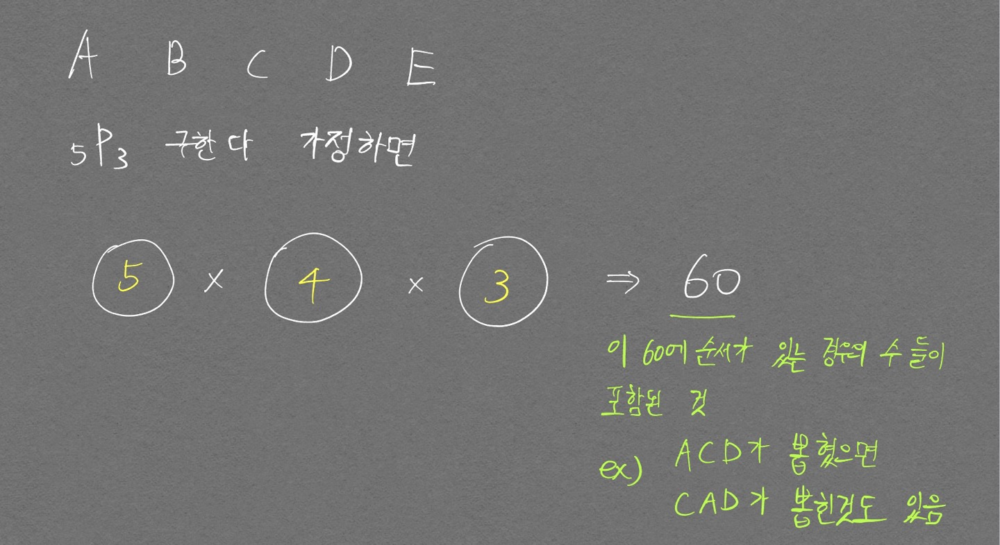
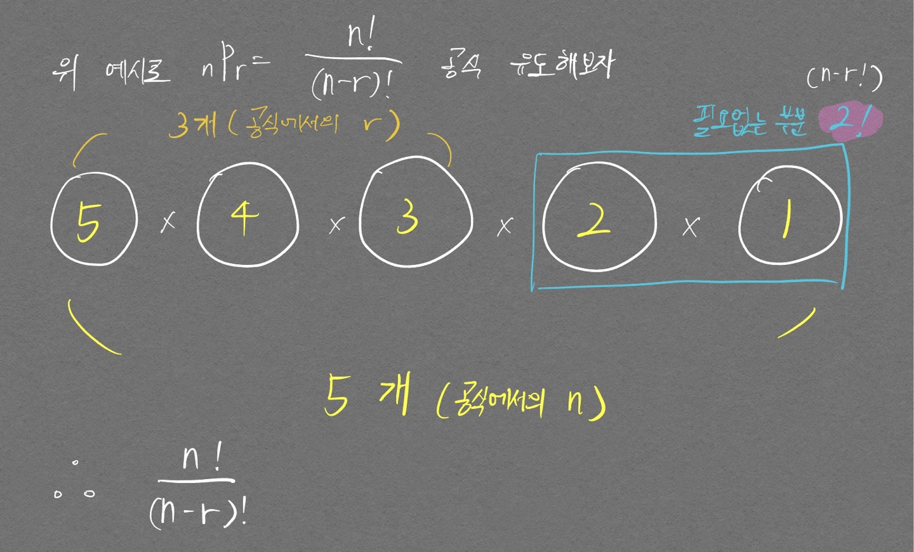
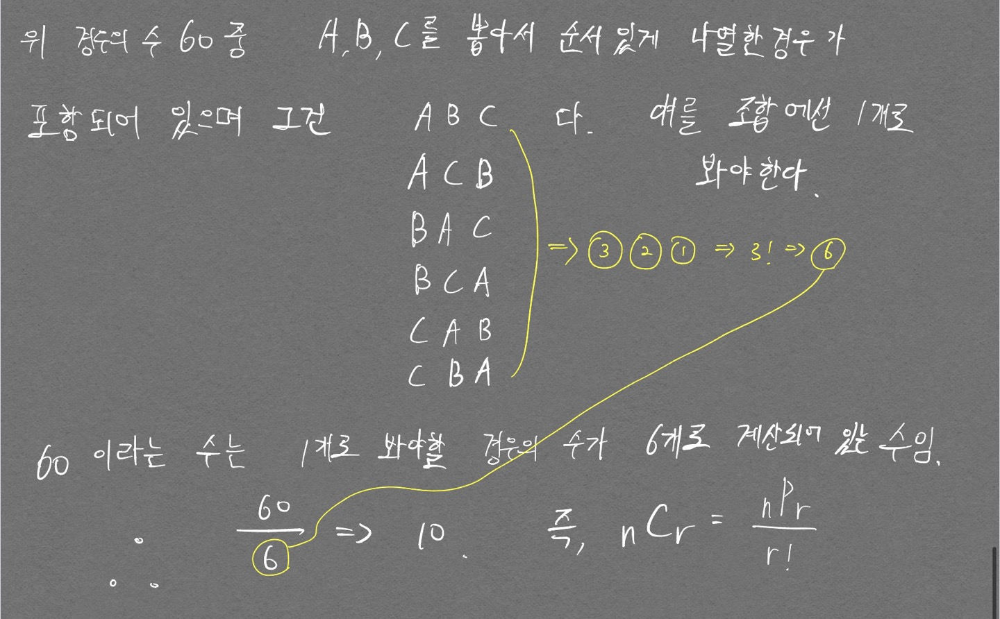

중요한 것은 순서! 
순열은 순서가 있고, 조합은 순서가 없다.  

# 순열
경우의 수를 구할 때 순서가 있을 경우는 순열에 해당한다.  
A, B, C, D 중 2개를 뽑아서 나열한다고 했을 때
AB, AC, AD, BC, BD, CD 에다가 순서가 있으므로, 순서에 따라서 다른 경우의 수가 되는것이여서  
BA, CA, DA, CB, DB, DC 까지가 경우의 수에 포함된다.  이것이 순열이다. 조합에 비해 고려해야 하는 경우의 수가 늘어나는 것이다.  

아래 그림으로 좀더 구체적으로 보자.  

  

## 공식 유도
 

  $${}_n P_r = {n! \over (n-r)!} $$ 

  

# 조합
순열과 달리 순서가 없기 때문에 **선택만 하면 된다**.  
위의 예시에서 AB, AC, AD, BC, BD, CD 로 고르기만 하면 된다.

## 공식 유도

  $${}_n C_r = {_n P_r \over r!}$$

  

# 요약 테이블

||순서|중복|표현|배열 방법|
|---|---|---|---|---|
|순열|O|X|$$_3 P_2$$|AB, BA, BC, CB, CA, AC|
|중복순열|O|O|$$_3 \Pi_2$$|AB, BA, BC, CB, CA, AC + AA, BB, CC|
|조합|X|X|$$_3 C_2$$|AB, BC, CA|
|중복조합|X|O|$$_3 H_2$$|AB, BC, CA + AA, BB, CC|

[파이썬 코드로 구현한 순열, 조합 확인해보기](/CodingTestPythonBasicGrammar/#완전탐색brute-force-개념-잡기)