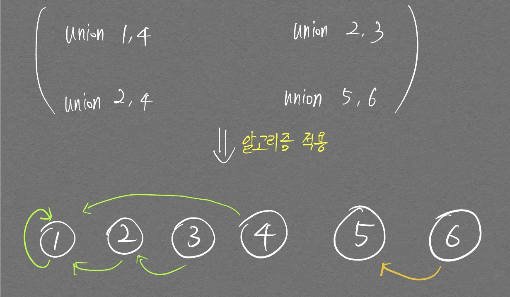

# 서로소 집합 자료구조

- 서로소: 여러 개 수들 사이에 1이외의 공약수가 없는 것
- 서로소 집합: 공통원소가 없는 두 집합
- 서로소 집합 자료구조(Union-find 자료구조라고도 함): 서로소 부분 집합들로 나누어진 원소들의 데이터를 처리하기 위한 자료구조

서로소 집합 자료구조라는 말의 정의가 애매해서 조금 더 구체화 해보자면, 여러 집합 정보가 있을 때 **같은 집합인 것을 찾아서 최대한 단순화 시키는** 자료구조로 보인다.  

<p align="center">  </p>
<div align="center" markdown="1"> 1, 2, 3, 4 노드의 루트 노드는 1  
5,6 노드의 루트 노드는 5  
루트노드가 1인 집합과, 루트노드가 5인 집합인 총 **2종류의 집합으로 나눠진 것**으로 볼 수 있다.
</div>

# Union-Find 연산
Union 연산은 두 원솔르 하나의 집합으로 합치는 알고리즘을 의미하며 Find 연산을 활용해서 구현된다.

- 진행 순서
  1. parent 테이블을 조회하여 union 연산을 진행하는 두 노드의 `Root Node`[^1]를 확인한다. 이때 `find`[^2] 연산이 사용된다.
  2. 두 노드의 `Root Node`중 큰 `Root Node`의 값을 작은 `Root Node`값으로 대체시킨다. 이를 통해 한쪽의 집합이 다른 한쪽에 속해지게 된다.

[^1]: `Root Node`는 부모 Node, 자기 자신 Node가 똑같은 Node를 의미하며, 이 `Root Node` 값이 현재 내 집합의 값이 된다. 즉 집합을 대표하는 값이다.
[^2]: 재귀적으로 `Root Node`를 찾는 연산

책에서 설명되는 화살표로 이어진 그래프 그림은 결국 parent 테이블의 정보만 활용해서 그려진 그림이다. 즉 parent 테이블을 갱신할 때 마다 화살표가 생기는 것으로 (혹은 수정되는 것으로) 여길 수 있다.

- 기본적인 서로소 집합 알고리즘 코드

```python
# 특정 원소가 속한 집합 찾기
# 아래와 같이 return 문에 재귀함수를 호출하는 구조는 곰곰히 생각해보면
# 종료조건을 수행한 가장 마지막 재귀함수의 return값을 그대로 최초의 호출한 find_parent 함수의
# 반환값으로까지 끌고오겠다는 것
def find_parent(parent, x):
  # 루트 노드가 아니면, 루트 노드 찾을때까지 재귀적 호출
  if parent[x] != x:
    return find_parent(parent, parent[x])
  return x

# 두 원소가 속한 집합 합치기
def union_parent(parent, a, b):
  a = find_parent(parent, a)
  b = find_parent(parent, b)
  if a < b:
    parent[b] = a    # parent[a]도 동시에 처리해줘야하지 않나 생각했지만
                     # 이 순간 Edge는 하나만 그린다. (부모, 자식 관계 결정)
  else:
    parent[a] = b

# 노드 개수와 간선(Union 연산) 개수 입력받기
v, e = map(int, input().split())
parent = [0] * (v+1)

# 부모 테이블상에서, 부모를 자기 자신으로 초기화
for i in range(1, v+1):
  parent[i] = i

# union 연산 각각 수행
for i in range(e):
  a, b = map(int, input(). split())
  union_parent(parent, a, b)

# 각 원소가 속한 집합 출력
print(f'각 원소가 속한 집합: ', end='')
for i in range(1, v+1):
  print(find_parent(parent, i), end=' ')

print()

# 부모 테이블 내용 출력
for i in range(1, v+1):
  print(parent[i], end=' ')
```

    6 4
    1 4
    2 3
    2 4
    5 6
    각 원소가 속한 집합: 1 1 1 1 5 5 
    부모 테이블: 1 1 2 1 5 5

위의 `parent` 테이블을 조회할 때 조회하면서 `Root Node`로 대체시키는 재귀함수를 구현하여 `find` 함수의 속도를 더 빠르게 올릴 수 있다.  

```python
def find_parent(parent, x):
  # 루트 노드가 아니면, 루트 노드 찾을때까지 재귀적 호출
  if parent[x] != x:
    parent[x] = find_parent(parent, parent[x])
    return parent[x]
  return x
```

# 무방향 그래프

간선에 방향성이 없는 그래프를 의미한다.  

아래에서 정리할 Cycle, 최소 신장 트리 개념은 [무방향 그래프에서만](#){:.button.button--outlier--primary.button--pill}사용 가능한 알고리즘이다.  

방향 그래프에 대해서는 좀 더 아래의 [위상 정렬 알고리즘](##위상-정렬-알고리즘)을 확인하자.

## 서로소 집합 알고리즘으로 할 수 있는것? Cycle 확인!

먼저 교재를 살짝 보고 내 나름대로 Cycle 확인 알고리즘을 구현했는데 실패하였다. 아래 적은 말을 꼭 기억해두자. 내가 헷갈렸던 부분을 한방에 정리해놨다.

두 노드간 연결관계를 처리할 때! (연결관계 처리하고나서가 아니라 처리할 때! 임) 두 노드의 `Root Node`(집합 관계)를 확인하고, 같은 집합이면 Cycle 판정을 내리고, 그렇지 않으면 Union 연산을 진행함.

```python
import sys

N, M = map(int, sys.stdin.readline().rstrip().split())
parent = [i for i in range(N+1)]

def find_parent(start):
  if start == parent[start]:    # 부모 노드랑 현재 노드랑 같으면
    return parent[start]        # 현재 노드 값 return
  parent[start] = find_parent(parent[start])
  return parent[start]

def union(a, b):
  root_a = find_parent(a)
  root_b = find_parent(b)

  if root_a < root_b:
    parent[root_b] = root_a

  else:
    parent[root_a] = root_b

# for _ in range(M):
#   a, b = map(int, sys.stdin.readline().rstrip().split())
#   union(a, b)

cycle = False

# 일단 union을 통해 구축해놔야 하는거 아님?
# 같지 않으면 union을 수행하네..
for _ in range(M):
  a, b = map(int, sys.stdin.readline().rstrip().split())
  if find_parent(a) == find_parent(b):
    cycle = True
    break
  else:
    union(a, b)

print(cycle)
```

## Cycle 확인으로 할 수 있는것? 최소신장트리 찾기! with 크루스칼 알고리즘

- 신장 트리: 하나의 그래프가 있을 때 **모든 노드**를 포함하면서 사이클이 존재하지 않는 **부분 그래프**

- 최소 신장 트리: 하나의 그래프에서 도출된 **여러개의 부분 그래프 중** 간선 비용이 가장 적은 신장 트리. 즉 최소 신장 트리는 딱 하나의 그래프임.

- 크루스칼 알고리즘: **최소 신장 트리를 찾는** 여러개의 알고리즘 중 **하나의 알고리즘**
  - 그리디(Greedy) 알고리즘
  - Cycle을 확인하는 Logic을 이해했다면 굉장히 쉽게 받아들일 수 있음
  - 알고리즘 설명
    1. 간선 데이터를 비용에 따라 오름차순 정렬(현재 상황에서 최소 비용인 간선을 Greedy하게 찾기 위함임)
    2. 간선을 하나씩 확인하며 Cycle 발생시키는지 확인
       1. 사이클이 발생하지 않는 경우 최소 신장 트리에 포함시킴
       2. 사이클이 발생하는 경우 최소 신장 트리에 포함하지 않음
    3. 모든 간선에 대해 2번 과정을 반복


## 크루스칼 알고리즘 내꺼 만들기

이론을 살피고 상당 기간이 지나며 다시 복기를 하며 코드를 짜는데 아래와 같이 `union` 함수를 짜고 있었다.

```python
def union(v1, v2):
    p1, p2 = find_parent(v1), find_parent(v2)

    parent[v1] = min(parent[v1], parent[v2])
    parent[v2] = min(parent[v1], parent[v2])
```

위 코드대로 union을 하면 크루스칼 알고리즘이 의도대로 작동하지 않는다. 서로소 집합에서 특정 `node`가 어떤 집합에 속하는지를 알기 위해선 `root`정보가 중요하며, `union` 연산은 한 `node`의 `root` 정보를 다른 `node`가 속한 `root`로 변경해줘야 한다.  
즉, 위 코드는 당장 내 부모의 노드를 변경해주는 것이기에, 집합의 속성을 변경시키는 코드라고 볼 수 없다. 내가 속한 집합(`root` 노드)을 변경해줘야 한다. 따라서 변경하면 다음과 같다.

```python
def union(v1, v2):
    p1, p2 = find_parent(v1), find_parent(v2)

    parent[p1] = min(p1, p2)
    parent[p2] = min(p1, p2)
```

- 입력

    7 9
    1 2 29
    1 5 75
    2 3 35
    2 6 34
    3 4 7
    4 6 23
    4 7 13
    5 6 53
    6 7 25

- 출력

    159

# 방향 그래프

## 위상 정렬 알고리즘

- 위상 정렬: 방향 그래프의 모든 노드를 **방향성에 거스르지 않도록 순서대로 나열하는 것**  
  - 대표적인 예시로는 과목 수강 과정을 나열할 때 사용 가능한 알고리즘
  - 알고리즘 설명
    1. 진입차수가 0인 노드를 큐에 넣는다.
    2. 큐가 빌 때 까지 다음의 과정을 반복한다.
       1. 큐에서 원소를 꺼내 해당 노드에서 출발하는 간선을 그래프에서 제거
       2. 새롭게 진입차수가 0이 된 노드를 큐에 삽입
    - 이때 모든 노드를 돌기 전에 큐가 비게되면 `Cycle`이 발생한 것으로 판단함

- 시간복잡도: 노드개수 V, 간선개수 E 일 때, $$O(V+E)$$

위상 정렬 알고리즘을 구현하는 경우엔 **서로소 자료구조**를 구현할 필요가 없다!
{:.info}

# 교재 문제

## 커리큘럼

```python
import sys

N = int(sys.stdin.readline().rstrip())

graph = [[] for _ in range(N+1)]

indegree = [0] * (N+1)

time = [0]

# i 값은 현재 수강 과목
for i in range(1, N+1):
  data = list(map(int, sys.stdin.readline().rstrip().split()))
  cost = data[0]
  time.append(cost)

  # j 값은 선수과목 정보
  for j in data[1:-1]:
    graph[j].append(i)
    indegree[i] += 1

# 위상 정렬
# 진입 차수 개념, 연결 정보를 활용해서 하나씩 지우는거. queue에 성공한 node 계속 집어 넣는거

def topology_sort():
  from collections import deque
  result = [0] * (N+1)
  q = deque()

  for i in range(1, N+1):
    if indegree[i] == 0:
      q.append(i)

  while q:
    now = q.popleft()
    
    # 한번도 초기화가 안 된 수강과목 이라면
    # 즉, 처음 방문한 거라면, 그냥 수업시간 넣으면 됨
    if result[now] == 0:
      result[now] = time[now]
      
    # 연결된 간선 지우기
    '''일단 연결된 차수 다 지우는게 먼저인가?
    그럴 필요 없이 차수 지울 때 마다 후보군으로 result 값 작성해 놓으면 됨. max일 경우 대체되는 logic 이니까'''
    for i in graph[now]:
      indegree[i] -= 1
      result[i] = max(result[i], result[now] + time[i])

      # 진입 차수 0인 연결된 노드가 발견되면 queue에 삽입
      if indegree[i] == 0:
        q.append(i)
        
  return result
result = topology_sort()

for i in range(1, N+1):
  print(result[i], end=' ')
```