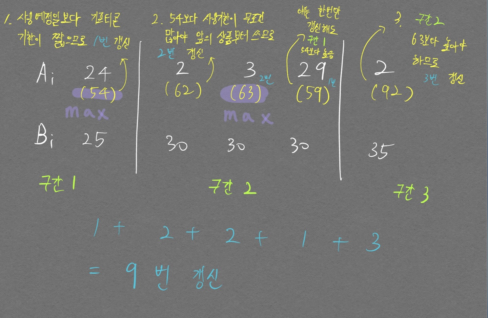
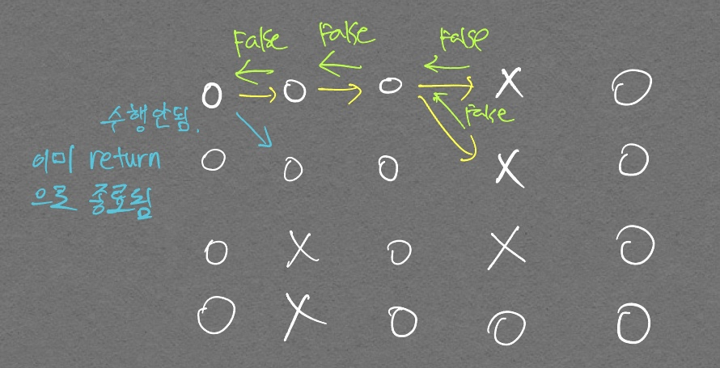
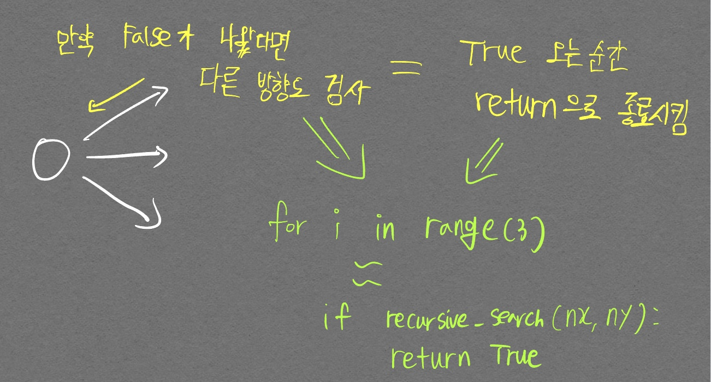

# 17420번 (깊콘이 넘쳐흘러)
난이도: 골드 1

풀이 보고 이해하는데만 정신 나가는 줄 알았다 ㅋㅋㅋ;;  

본 문제에서 가장 중요하게 봐야할 점은 다음의 2가지라 생각한다.  
1. 기프티콘의 사용 기한이 가장 적은것을 선택한다는 제약조건
2. 기프티콘 사용 기한보다 사용 예정일이 클 경우 갱신을 해줘야 한다는 것 (이 말은 사실 당연한 것이지만 풀이 코드를 보고 이해하는데 이 말을 곱씹는게 나한테 중요했다)

다음 그림에 내가 이해한 모든것을 담았다.  

<p align="center">  </p>

아래 정답 코드를 보면 알겠지만, 위 그림처럼 $$B_i$$ (사용예정일)를 중심으로 나열하기 위해 오름차순 정렬을 진행한 부분이 있다.  
```python
for i in range(n):
  li.append([fi_li[i], la_li[i]])

li.sort(key=lambda x: x[1])
```

- 제출 코드  

```python
import sys
input = sys.stdin.readline

n = int(input())

fi_li = list(map(int, input().split()))
la_li = list(map(int, input().split()))

li=[]
for i in range(n):
  li.append([fi_li[i], la_li[i]])

li.sort(key=lambda x: x[1])

prev_max = li[0][1]    # 이게 prev_max가 되는지는 아직 이해 안됨
                       # 이해 되서 블로그에 정리함
cur_max = 0
answer = 0

for idx, (fi, la) in enumerate(li):
  if prev_max > fi:   # 이전 구간의 최댓값이 현재 구간의 남은 사용기한 보다 크다면
                      # 갱신 필요하므로 이 if문 아래에서 갱신 진행
    
    # 이전 구간의 최댓값 보다 현재 구간의 B_i가 더 크다면 갱신
    # B_i가 계속 prev_max쪽으로 들어가나..?
    if prev_max < la:
      prev_max = la

    # 29를 더해주면 나머지가 1 이상일 때 몫을 1 추가한 것과 같다.
    # cnt = int(((prev_max - fi) + 29) / 30)
    if (prev_max - fi) % 30 == 0:
      cnt = (prev_max - fi) // 30
    else:
      cnt = (prev_max - fi) // 30 + 1

    
    # 구간별 나눠져 있는 그림을 재현하기 위해 원본 리스트 값 변경
    li[idx][0] += cnt*30
    answer += cnt

  # 같은 구간의 최댓값 찾기
  cur_max = max(cur_max, li[idx][0])

  # 구간 변경시 같은 구간 값 중 최대값을 이전값으로 갱신
  # 인덱스 초과에러 안나려고 이런식으로 if문에 and 붙여서 구현할 수 있음
  if idx + 1 < n and la != li[idx+1][1]:
    prev_max = cur_max

print(answer)
```

# 3109번 (빵집)

- 내 코드

```python
import sys
# input = sys.stdin.readline.rstrip()

R, C = map(int, input().split())

answer = 0

graph = []
for i in range(R):
  # graph.append(list(input))
  graph.append(list(sys.stdin.readline().rstrip()))

dx = [-1, 0, 1]
dy = [1, 1, 1]

visited = [[0]*C for i in range(R)]    # 방문한 그래프

# 그래프 인덱스 1부터 시작하도록 구현
def recursive_search(cx, cy):
  # 종료조건 1. 끝까지 도달했을 경우
  # print(f"{cx, cy}로 이동!")
  if cy >= C-1:
    return True

  for i in range(3):
    nx, ny = cx+dx[i], cy+dy[i]
    # if 1<= nx <=R and 1 <= ny <= C and graph[nx-1][ny-1] == '.' and visited[nx-1][ny-1] == 0:
    if 0<= nx < R and 0 <= ny < C and graph[nx][ny] == '.' and visited[nx][ny] == 0:  
      visited[nx][ny] = 1
      if recursive_search(nx, ny):
        return True
      # return recursive_search(nx, ny)

  # 끝까지 못갔을 경우
  return False

for i in range(R):
  # print(f"{i} 번째 시작")
  if recursive_search(i, 0):
    answer += 1

print(answer)
```

처음에 반복문으로 풀려고 하다가 도저히 안풀려서 풀이 코드를 본 후 재귀 함수를 적용하길래 해당 아이디어를 그대로 사용하여 내 방식대로 코드를 짰다. 주석 친 `return recursive_search(nx, ny)` 때문에 애를 많이 먹었다. 저런식으로 `for문` 안에서 return을 그대로 사용할 경우  
<div align="center" markdown="1">  `한번이라도 if문을 들어간 그 순간의 함수는 재귀 호출이 끝나면 남은`{:.error} `for문``의 인덱스를 돌지않고`{:.error} 종료된다.
</div>


- 그림을 통한 이해

<p align="center">  </p>
<div align="center" markdown="1"> 엣지 케이스 그림 
</div>

<p align="center">  </p>
<div align="center" markdown="1"> `for문` 안에서 if문으로 조건을 한번 더 걸어줘야 하는 이유
</div>