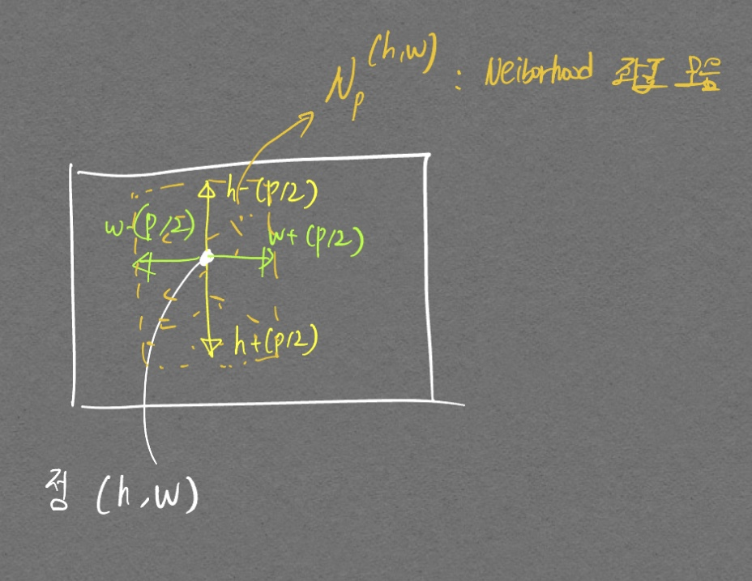
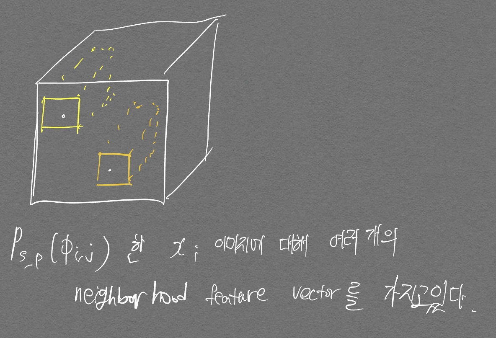

# 논문 이해를 위한 Source

- [ysco님 블로그](https://ysco.tistory.com/20)

# Method
1. Make a memory bank of patch features
    - Memory bank: 
    - 쓰는 이유: middle level of feature 들을 사용하기 위함
2. Reduce the memory bank with coreset
3. Detect anomaly with the memory bank

# 수식 이해

$$ \phi_{i, j} = \phi_j(x_i) \in R^{c^* \times h^* \times w^*} $$

- $$ \phi_{i, j}$$는 결국 Pretrained model의 정상데이터 i에 대한 j번째 layer의 `feature` 이다.

$$ \phi_{i, j}(h, w) = \phi_j(x_i, h, w) \in R^{c^*} $$

- 좌표 정보 $$ (h, w) $$ 를 주면 $$ c^*$$ 차원을 가진 vector 들을 얻을 수 있음.

$$ N_{p}^{(h, w)} = \{ (a, b) | a \in [h - \lfloor p/2 \rfloor, \cdots , h + \lfloor p/2 \rfloor], b \in [w - \lfloor p/2 \rfloor, \cdots , w + \lfloor p/2 \rfloor]\} \\ \phi_{i, j}(N_{p}^{(h, w)}) = f_{agg}(\{\phi_{i, j}(a, b) | (a,b) \in N_{p}^{(h, w)} \})$$

  

 (h, w) 좌표 기준 주변 좌표들의 모음이다. 

- 즉 (h, w) 좌표 주변부 픽셀들에 대한 $$c^*$$ 차원 feature vector들을 가리키는 말이다. 이때 $$f_{agg}$$ 에서 Adaptive average pooling[^1]을 사용하여 나오는 feature 수를 제한함.
- channel에 대해서 pooling을 하는것인지, height width에 대해 pooling을 하는것인지 아직 잘 모르겠다. (channel에 대한 pooling인 듯하다)

[^1]: Average pooling은 이미지의 크기에 따라서 Tensor 크기가 달라지지만 Adaptive average pooling은 원하는 output Tensor를 고정할 수 있다 [Pytorch 링크](https://pytorch.org/docs/stable/generated/torch.nn.AdaptiveAvgPool2d.html).

$$ P_{s, p}(\phi_{i, j}) = \{\phi_{i, j}(a, b) | (a,b) \in N_{p}^{(h, w)} | h, \, w \, mod \, s  = 0, h < h^*, w < w^*, h, w, \in \mathbb{N}\}$$

- $$P_{s, p}(\phi_{i, j})$$는 여러 좌표에서의 neightbood feature vector들을 가지고 있는 `하나의 patch`{:.warning} 라고 생각하면 될 듯 하다.

  

$$ M = \bigcup\limits_{x_i \in X_N} P_{s, p}(\phi_j(x_i))$$

- patch를 모은것이 $$ M $$ (메모리 뱅크)이다.