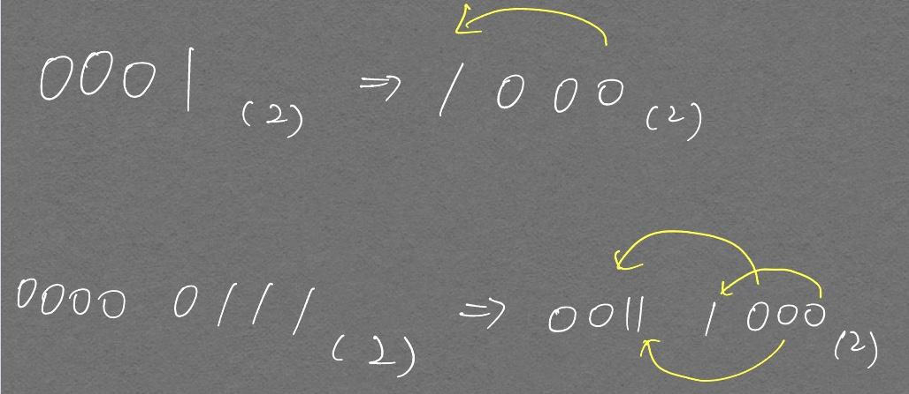

코딩을 하면서 Bit Operator가 유용하게 쓰이는 경우가 많은데 이를 잘 활용하지 못하고 있는것 같아 정리해보려고 한다.  

# Bit shift 연산

정수를 2배로 곱하거나 나누어 계산해 주는 경우에 활용 가능하다.  

```python
1 << 3, 7 << 2
```
        (8, 28)

<p align="center">  </p>

shift 연산자 뒤의 값 `n`이 $$ 2^n $$을 의미한다는 것을 기억하자.  
`1 << 3` -> $$ 1 \times 2^3 $$, `7 << 2 ` -> $$ 7 \times 2^2 $$