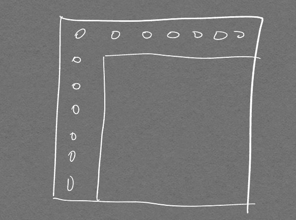
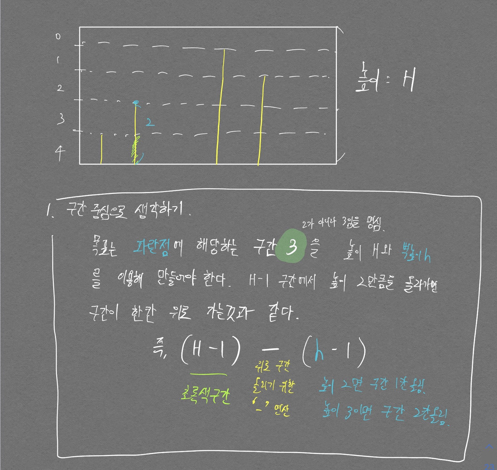
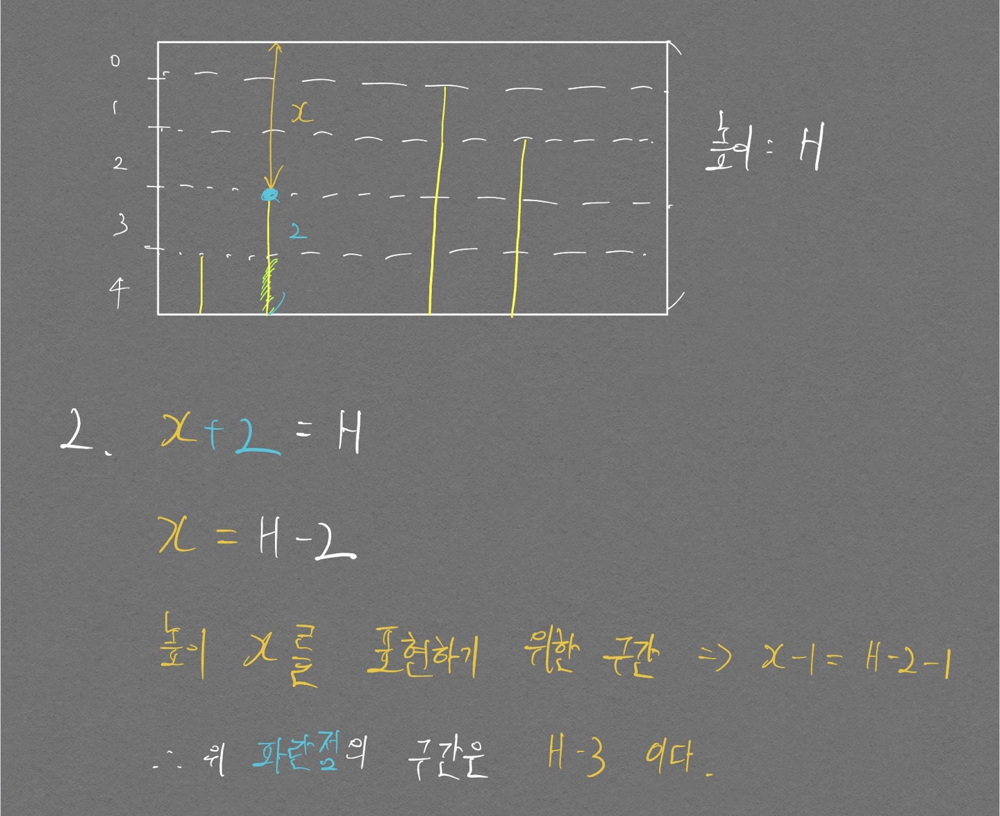
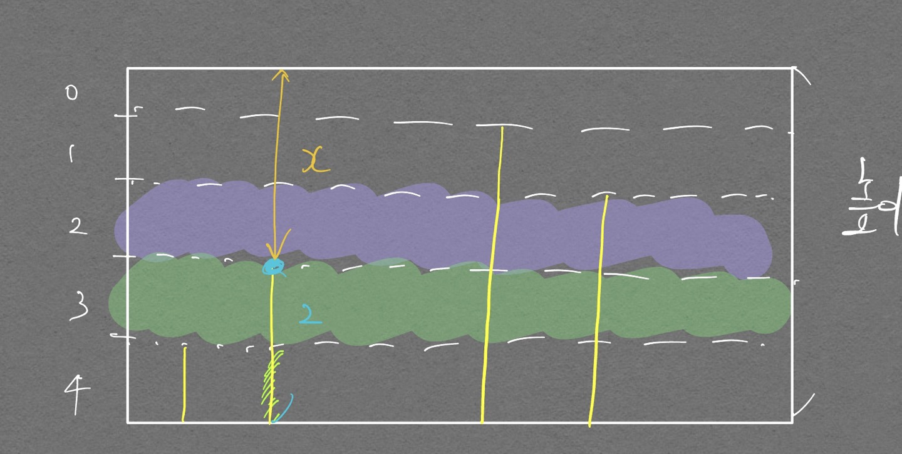
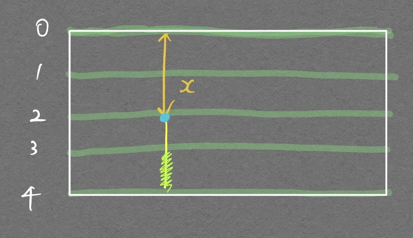

# 11660번 (구간 합 구하기 5)

출처: 백준  
난이도: 실버 1

누적합이라는 새로운 방식의 접근법과, 2차원 그래프에서의 인덱스 문제(0에서 시작할지 1에서 시작할지)등에서 많이 깨졌다.. 여러모로 다시 봐야 할 유형이다.  

처음에는 0,0을 시작지점으로 잡고 문제를 풀려고 했는데 테스트케이스에서 x1, y1 좌표를 (1, 1)로 주는 순간 리스트의 인덱스가 `-1`로 접근해서 내가 원하는 결과가 나오지 않게 되었다.

<p align="center">  </p>  

해당 문제는 위 그림과 같이 0으로 저 부분을 둘러쌓아주면 해결이 가능하였다.

```python
import sys
input = sys.stdin.readline

N, M = map(int, input().split())

matrix = []
matrix.append([0] * (N+1))

for i in range(N):
    matrix.append([0] + list(map(int, input().split())))

for i in range(1, N+1):
    for j in range(1, N):
        matrix[i][j+1] += matrix[i][j]

for i in range(1, N+1):
    for j in range(1, N):
        matrix[j+1][i] += matrix[j][i]

for i in range(M):
    x1, y1, x2, y2 = map(int, input().split())
    answer = matrix[x2][y2] - matrix[x1-1][y2] - matrix[x2][y1-1] + matrix[x1-1][y1-1]
    print(answer)
```

# 3020번 (개똥벌레)

- 일단 어떻게든 풀고 싶어서 깡구현으로 테스트 케이스만 맞추도록 하였다.
- matrix를 내 맘대로 접근해서 값을 채워놓고 하는것이 아직 어색하다.

```python
import sys
from collections import defaultdict
input = sys.stdin.readline

N, H = map(int, input().split())

matrix = [[0] * N for _ in range(H)]

heights = []
for i in range(N):
  heights.append(int(input()))

# matrix 초기화
for i in range(N):
  j = heights[i]
  
  for j in range(j):
    if i % 2 == 0:
      matrix[H-1-j][i] = 1
    else:
      matrix[j][i] = 1

min_blocks = 1e9

dict = defaultdict(int)

for i in range(H):
  blocks = 0
  for j in range(N):
    if matrix[i][j] == 1:
      blocks += 1
  dict[blocks] += 1
  min_blocks = min(min_blocks, blocks)

print(min_blocks, dict[min_blocks])
```

- Matrix 개념 완벽 잡기
  - 이 문제를 풀면서 인덱스 문제에서 굉장히 애를 먹었다. 내가 헷갈렸던 부분은 다음과 같다.

<p align="center">  </p>
<div align="center" markdown="1"> 위 1번 방식으로 접근했을때는 문제가 없었지만, 아래 두번째 방식에서 문제가 발생하였다 
</div>

<p align="center">  </p>
<div align="center" markdown="1"> 어떤 문제가 발생하는지 곰곰히 생각해보자. 바로 찾으셨다면 저보단 머리가 최소 3천배는 좋으실 듯.. 
</div>

<p align="center">  </p>
<div align="center" markdown="1"> 위 그림처럼 x 높이로 인한 구간과, 아래에서 위로 올라오는 벽돌의 파란점이 가리키는 구간이 서로 달라진다는 점이다. 그러므로 방식2로 인덱스를 지정하면 답이 틀리게 된다. 
</div>

<p align="center">  </p>
<div align="center" markdown="1"> 가령 위와 같이 구간이 나눠진다면 방법 2로 접근해도, 높이 x가 가리키는 점과 벽 높이 h가 가리키는 구간이 같은것이여서 방법 2로 접근해도 무방할 것이다. 
</div>

사소한 것일 수도 있지만 어떻게 생각하면 굉장히 중요한 개념이라고 생각하기에 이렇게 별도로 정리해보았다.

- 위 방식을 적용한 내 풀이 코드

```python
import sys
input = sys.stdin.readline

N,H = map(int, input().split())

down = [0] * 500000
top = [0] * 500000

# top, down을 특정 구간(특정 높이)의 벽돌 갯수로 초기화
# top 기준에서 구간과 높이의 차이는 -1
# down 기준에서 구간과 높이의 차이는 H-1
for i in range(N):
  if i % 2 == 0:
    down[H-1 - (int(input()) - 1)] += 1
  else:
    top[int(input()) - 1] += 1

# top, down 누적합으로 특정 구간에서의 충돌횟수 구함
for i in range(H-1, 0, -1):
  top[i-1] += top[i]

for i in range(0, H-1):
  down[i+1] += down[i]

min_result = 1e9

for i in range(H):
  result = top[i] + down[i]
  min_result = min(result, min_result)

cnt = 0
for i in range(H):
  if top[i] + down[i] == min_result:
    cnt += 1

print(min_result, cnt)
```