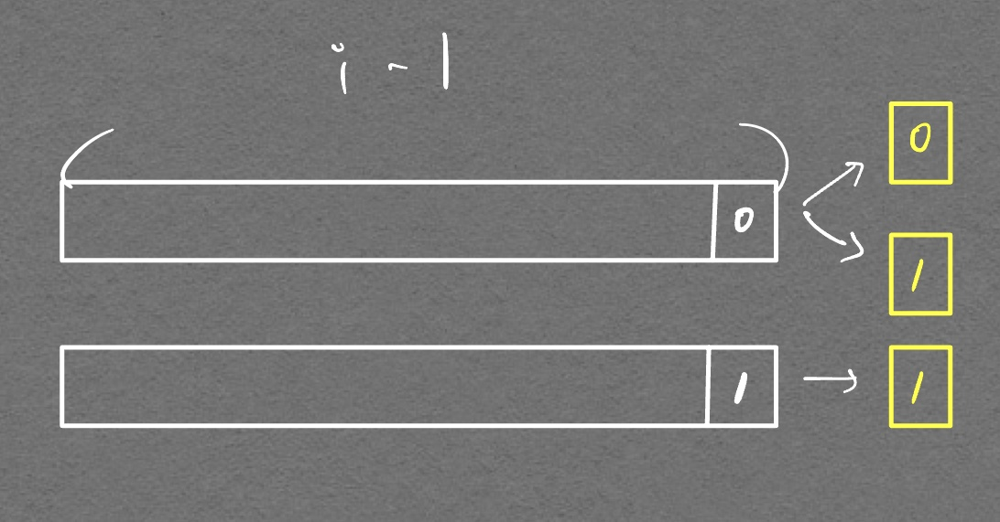
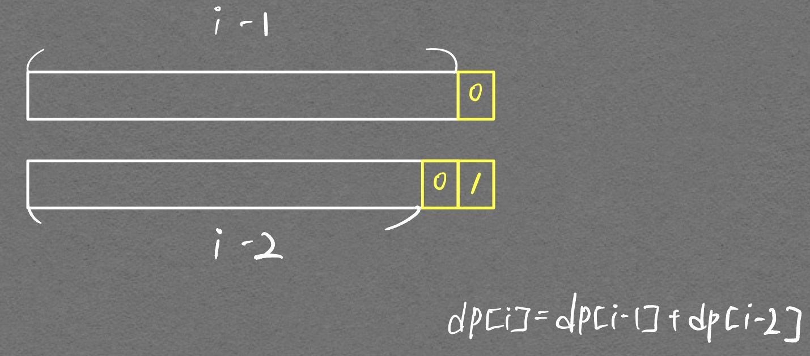
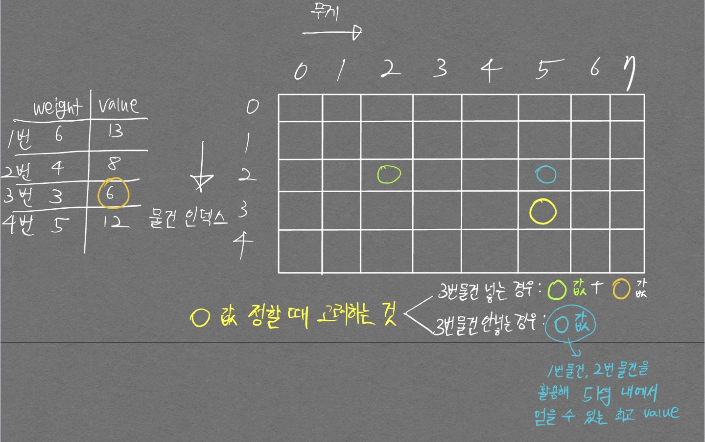

# 1463번 (1로 만들기)

- 내 풀이

```python
N = int(input())

d = [0] * 1000001
# d = [0] * (N+1)

d[0] = 0
d[1] = 0
d[2] = 1

for i in range(3, N+1):
  d[i] = d[i-1] + 1

  if i % 3 == 0:
    d[i] = min(d[i], d[i//3] + 1)

  if i % 2 == 0:
    d[i] = min(d[i], d[i//2] + 1)

print(d[N])
```

변수를 입력받은 후 그에 걸맞게 메모리를 할당하는 방식인 동적할당을 사용하려 했으나 `index error`가 발생하였다. 그 원인은 N=0 일 때 `d[2]`에 접근할 수 없어서 생기는 에러였다. DP 테이블을 초기화 할 때는 항상 동적할당이 아닌 정적할당으로 초기화 해주는 게 좋을 듯 하다.

# 11727번 (2xn 타일링 2)

- DP 문제이기는 하지만 완전 탐색과 DFS 등의 개념을 보고 있었어서 먼저 DFS로 풀어보고자 하였다.
- 테스트 케이스의 경우는 맞췄지만 제출하니 run time error가 발생하였다.


```python
import sys
sys.setrecursionlimit(10000)

N = int(input())

answer = 0
# 중복 허용 및 순서 고려하는 순열
def dfs(depth):
  global answer
  
  if depth == N:    # 다 채웠으면 경우의 수 1개 채워
    answer += 1
    return
    
  for i in range(3):
    # 마지막 한 칸 넣는건데 가로 두칸짜리 블록 넣는거 피하기 위함
    if i >= 1 and depth == N-1:
      continue

    if i == 0:
      dfs(depth+1)    # 세로 한칸은 한칸 채우는 것

    if i == 1:
      dfs(depth+2)    # 세로 두칸은 두칸 채우는 것

    if i == 2:
      dfs(depth+2)    # 다른 유형의 2칸 채우는 것

dfs(0)

print(answer % 10007)
```

# 2293번 (동전 1)

4줄짜리 코드 이해하는데 5시간 걸린 문제다... ㅜㅜ  

핵심은 아래와 같다.
- `d[i]`: 모든 동전 종류를 중복을 허용하며 뽑았을 때의 합이 `i`원인 **경우의 수**
- 로직 이해하기
  - 먼저 이해를 돕기 위해, 이 로직은 `coins = [1, 2, 5] \n for c in coins:`를 통해 동전을 하나씩 선택하고, 그 동전으로 만들 수 있는 경우의 수를 기존에 선택한 동전이 만들어낸 경우의 수를 **누적해서 더하는** 방식으로 구현되어 있다는 것을 숙지하자.
  - 가장 처음, 동전 1원이 선택되었을 경우
    - `d[1] = d[1] + d[0]`, `d[1] = d[2] + d[1]`, ... , `d[10] = d[10] + d[9]` 를 의미하는 `d[i] = d[i] + d[i-1]`의 우변 항이 의미하는 바는 다음과 같다.
      - `d[i-1]`: **여태까지 구한 각 경우에 대해 맨 끝에 1만 붙여준 것**
      - `d[i]`: **여태까지 구한 경우 누적을 위해 존재** (메모이제이션 기능 수행을 위한 항)
      - 현재는 동전 1원에 대해서만 시행한 것이므로 아직 이해가 안될 것이다. 2원짜리 동전이 활용되는 다음 부분을 보자
  - `for c in coins`의 두번째 c 값으로 2원이 뽑힌 경우. (메모이제이션으로 인해 1원, 2원이 모두 활용되는 경우가 계산됨)
    - `d[i] = d[i-2] + d[i]` 1원만 있을 경우에 비해 이번에는 2가지 종류의 동전이 있고, 이때는 `d[i]`에다가(현재의 `d[i]`는 이미 1원만 선택했을때 계산된 경우의 수가 들어가있음) + `d[i-2]`(이미 d[i-2]도 이전에 1원짜리로만 할 수 있는 경우의 수 값이 들어있는 상태)의 모든 경우 맨 끝에 2를 세운 경우의 수가 **같이 더해지기 때문에** `d[i]`는 1원, 2원을 모두 활용했을 때 나오는 경우의 수가 된다.
    - 즉 여태까지 한 내용을 요약하면, i원을 만들기 위해 1원, 2원으로 할 수 있는 모든 경우의 수를 구한 것이다. 다음의 `for c in coins` 경우를 통해 5원짜리 동전에 대해서 같은 내용을 수행하면, i원을 만들기 위해 1, 2, 5원짜리 동전이 모두 활용된 경우의 수가 `dp[i]`에 저장된다.

```python
for c in coins:       # c는 coin 종류
  for i in arr:       # dp 테이블 채우기 위한 for문
    if i-coin >= 0:   # Index Error 방지
      d[i] += d[i-c]
```

이때 중요한것이 `d[0] = 1`로 초기화 하는 것이다. 그 이유는 동전 종류가 1이 있다고 생각해 봤을 때 `d[1] = d[0] + d[1]`로 `d[1] = 1`로 만들기 위해선 `d[0] = 1`이 되어야 하기 때문이다. 동전 종류가 2원일 때 `d[2] = d[2] + d[0]`에서의 `d[0]`이 0을 만드는 경우의 수에 맨끝에 2를 붙이는 경우의 수 이므로 1이 된다. 이 말을 받아들이기는 처음엔 좀 당황스러울 것이나, 계속 생각하고 직접 종이에 써가면서 보면 그 흐름이 이해가 갈 것이다.  


위 코드 흐름을 보고 다시 다이나믹 프로그래밍 개념에 대해서 복기해보자. 다이나믹 프로그래밍은 2가지를 기억해야 한다.
1. 전체 문제를 부분 문제로 쪼갤 수 있다.
2. 이전에 구한 부분 문제의 값을 현재 문제에 **재사용** 할 수 있다.


이 2가지를 기억하면서 위 Logic을 2293번 문제를 다시 정리해보자.

1. 전체 문제를 부분 문제로 쪼갤 수 있다.
  - 모든 동전을 활용했을 때 값이 K가 나오도록 하는 조합의 수 -> 모든 동전을 활용했을 때 값이 1<= i <= K 가 나오도록 하는 조합의 수 -> 모든 동전을 활용했을 때 값이 i 가 나오도록 하는 조합의 수
2. 이전에 구한 부분 문제의 값을 현재 문제에 **재사용** 할 수 있다.
  - `for coins = [1, 2, 5] \n for c in coins:` 를 예로 들어서, 특정 동전(1원일 때, 2원일 때, 5원일 때)에 대해서 경우의 수를 구하는데, 5원에 대해 경우의 수를 구하는 상황에는 이미 1, 2원을 활용한 경우의 수가 `dp` 테이블에 저장되어 있는 상태. 즉 기존 부분문제 값을 현재 문제에 **재사용** 하는 것이 된다.

다음은 정답 코드이다.  

```python
import sys

N, K = map(int, sys.stdin.readline().rstrip().split())

coins = []
for i in range(N):
  coins.append(int(sys.stdin.readline().rstrip()))

coins.sort()    # 꼭 sort 할 필요는 없다.

d = [0] * 10001

d[0] = 1

for c in coins:
  for i in range(c, K+1):
    if i - c >= 0:
      d[i] = d[i] + d[i-c]

print(d[K])
```

# 2294 (동전 2)
출처: 백준  
난이도: 골드4

- 한방에 맞췄당 

```python
import sys

N, M = map(int, sys.stdin.readline().rstrip().split())

arr = []

for _ in range(N):
    arr.append(int(input()))

d = [1e9] * 100001

d[0] = 0

for i in range(1, M+1):
    for j in arr:
        if 0<= i-j < M+1:
            d[i] = min(d[i], d[i-j] + 1)

if d[M] == 1e9:
    print(-1)
else:
    print(d[M])
```

# 2193번 (이친수)

처음에 못풀고 나중에 다시 풀었을 때, 향상된 추상화 실력으로 피보나치 수열임을 간파하여 풀기는 하였으나, DP 방식을 이용해 풀지 못해서 찜찜했다. DP 방식을 꾸역꾸역 적용해서 풀어보려고 했는데 아래와 같이 **잘못 접근 했다.** 잘못 접근한 방식을 보고, 다음부턴 이렇게 하지 말자.

<p align="center">  </p>
<div align="center" markdown="1">
초기 접근 방식. 뭔가 점화식을 도출 할 수 있을듯한 느낌이 들었다.
</div>

<p align="center">  </p>
<div align="center" markdown="1">
그러나 $$ dp[i] = something $$ 으로 점화식을 세우려면, dp[i-1]의 경우의 수가 각각 맨 끝이 0인것, 1인것으로 나눠줘야 하는 추가 조건이 붙는다. DFS 형태로 구현하면서 맨 뒤에 11이 연속으로 붙는경우를 제외한다면, 문제를 풀 수 있겠지만 $$O(2^{90})$$ 이라는 괘랄한 시간복잡도가 발생하기에 (DFS 90번 연속 호출로 인해 `for문`이 90번 중복된다) 시간초과가 발생한다. 고로 깔끔하게 점화식을 설계하고, 메모이제이션을 해서 $$O(n^3)$$ (n이 약 $$10^2$$라고 가정했을 때) 안에 풀어내야 한다.

즉, $$ dp[i] = something $$ 으로 깔끔하게 **점화식을 세울 수 없다.**
</div>

그렇다면 어떻게 해야 깔끔하게 점화식을 세울 수 있을까? 아래와 같이 생각하면 가능하다.

<p align="center">  </p>
<div align="center" markdown="1">
dp[i]는 2가지 경우로 나뉠 수 있다. 가장 끝에 0이 오는것과, 가장 끝에 1이 오는 것으로. 그럼 이걸 어떻게 깔끔하게 점화식을 세울 수 있을 까? 위와 같이 가장 끝에 0은 이전의 모든 경우에 붙일 수 있단 것을 적극 활용한다. 이걸로 점화식이 세워진다. 가히 예술이다...
</div>


$$ dp[i] = dp[i-1] + dp[i-2] $$


```python
import sys

N = int(sys.stdin.readline().rstrip())

explorer = [1]

cnt = 0

def dp():
    d = [0] * 91
    d[0] = 0
    d[1] = 1
    d[2] = 1

    for i in range(3, N+1):
        d[i] = d[i-2] + d[i-1]

    print(d[N])

dp()
```

# 12865번 (평범한 배낭) - 다시 풀어볼 것. 2022.10.18

- DP가 좀 익숙해지니 table을 2차원으로 구성해야 한다는것 까지는 알았음. 풀진 못했지만 ㅋㅋ
- 핵심 그림

<p align="center">  </p>

# 2533번 (사회망 서비스)

- 다시 풀어야 하는 문제다. 아주 어렵다 ㅜㅜ
- DFS 개념, DP 개념이 들어가고 마지막 답을 `print(min(dp[N][0], dp[N][1]))`로 하면 에러가 난다. N 대신 N-1을 넣으면 통과가 된다. 대체 뭔 차이지..

```python
import sys
sys.setrecursionlimit(int(1e9))

N = int(sys.stdin.readline().rstrip())

# 무방향 그래프.
# 인접 그래프 형태로 구현
# 1부터 Node가 시작하는것을 고려해줌

''' 
N이 10^6 이므로 인접리스트로 구현하면 망함..
10^12면 메모리 부움..
'''
# graph = [[INF] * (N+1) for _ in range(N+1)]
graph = [[] for _ in range(N+1)]

for _ in range(N-1):
    a, b = map(int, sys.stdin.readline().rstrip().split())
    graph[a].append(b)
    graph[b].append(a)
    # graph[a][b] = 1
    # graph[b][a] = 1
    
# print(graph)
# print(graph[3])
    
dp = [[0, 1] for _ in range(N+1)]

visit = [False] * (N+1)

# Tree의 leaf Node와 DP를 섞는 개념
# leaf Node 까지 방문
# 근데 방문조건을 꼭 설정해줘야 하는디..
def dfs_dp(node):
    # 방문 처리
    visit[node] = True
    
    # Node에서 출발하는 모든 Node들의 연결정보
    # for idx, connected in enumerate(graph[node]):
    for child in graph[node]:
        # 종료조건은 더이상 들어갈 Node가 없을 때
        # if connected==1 and not visit[idx]:
        if not visit[child]:
        # if child == 1 and not visit[child]:
            dfs_dp(child)

            # 현재 노드가 얼리어답터라면
            # 자식 노드들은 얼리든 아니든 상관없음
            dp[node][0] += dp[child][1]

            # 현재 노드가 얼리어답터가 아니라면
            # 연결된 자식들은 모두 얼리어답터여야 함
            dp[node][1] += min(dp[child][0], dp[child][1])

            

dfs_dp(N-1)
# print(dp)
# 뭐든 상관 없는듯..?
print(min(dp[N-1][0], dp[N-1][1]))
```

# 카카오 2022년 하반기 신입 공채 2번(아마도 DP 문제였던것으로 기억)

.