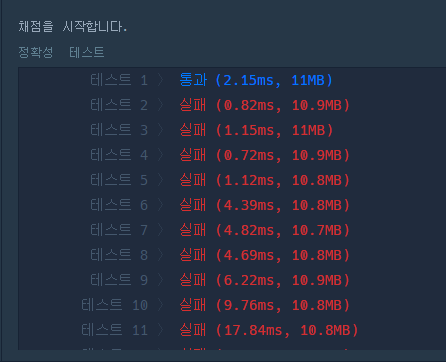

# 11404번 (플로이드)

분명 코드를 제대로 작성한 것 같은데 테스트 케이스가 틀려서 시간을 좀 사용하였다.  
문제에서 출발한 도시에서 출발한 도시에 바로 도착하는 경우는 없다고 하길래 나는 이 부분을 `INF`로만 두면 플로이드 워셜 알고리즘 이후에 대각 행렬이 `INF`값을 유지할 줄 알았다.  
하지만 다음의 경우때문에 대각 행렬의 값이 갱신된다.  

<p align="center">  </p>

```python
import sys

n = int(sys.stdin.readline().rstrip())
m = int(sys.stdin.readline().rstrip())

INF = int(1e9)
  
graph = [[INF] * (n+1) for _ in range(n+1)]

for _ in range(m):
  a, b, c = map(int, sys.stdin.readline().rstrip().split())
  graph[a][b] = min(graph[a][b], c)

def fluid(graph):
  for k in range(1, n+1):
    for i in range(1, n+1):
      for j in range(1, n+1):
        graph[i][j] = min(graph[i][j], graph[i][k] + graph[k][j])

fluid(graph)

for i in range(1, n+1):
  for j in range(1, n+1):
    if graph[i][j] == INF:
      print(0, end=' ')
    elif i == j:
      print(0, end=' ')
    else:
      print(graph[i][j], end=' ')
  print()
```

# 등산 코스 정하기
출처: 카카오  
난이도: lv3

어떻게 어떻게 다익스트라 까지 적용해서 문제를 풀어봤지만 결과는..
<p align="center">  </p>
<div align="center" markdown="1">
대 폭 망
</div>

아래는 제출했을 때의 내 코드다. 상당히 코드를 지우고, 바꾸고 해서 드럽다..  

```python
import heapq

# 다익스트라
# gate를 입력으로 받아서 각 gate별로 최단 경로 찾음
# graph는 인접리스트로 생각하자
def dijkstra(graph, start, summits):
    distance = [int(1e9)] * 50001
    q = []
    distance[start] = 0
    heapq.heappush(q, [0, start])   # 처음 start의 distance는 0으로 두고 시작
    # saved_path = [[0, start]]   # 최단 거리 path를 계속 저장해보자
                                  # 이 최단거리는 계속 갱신되는 상황을 반영하지 못함
    intensity = [int(1e9)] * 50001
    
    while q:
        dist, node = heapq.heappop(q)
        
        if distance[node] < dist:       # 현재의 dist보다 더 빠른 경로를 이미 갖고 있다면
            continue                    # 다음 반복으로 바로 넘어가도 무방함

        for con_nodes in graph[node]:   # 다익스트라의 핵심 logic은 현재 상태에서 distance 테이블에 있는 
                                        # 거리 정보보다 더 짧은 경로가 있는지 확인하고, 찾았을 시 갱신하는 것이다.
                                        # 인접한 노드들 중에 거리 정보를 갱신할 수 있는게 있다면
            cost = dist + con_nodes[0]
            if cost < distance[con_nodes[1]]:
                distance[con_nodes[1]] = cost
                intensity[con_nodes[1]] = con_nodes[0]
                heapq.heappush(q, [cost, con_nodes[1]])
                # saved_path.append([dist, con_nodes[1]])
                
            # con_nodes.sort()
            # distance[con_nodes[0][1]] = con_nodes[0][0]
            # heapq.heappush(q, [dist, con_node)
            # saved_path.append([dist, connected_node])
            
            # 산봉우리와 연결되었다면
                if con_nodes[1] in summits:
                    # saved_path.append([dist, con_nodes[1]])
                    # distance.sort(reverse=True)
                    intensity.sort()
                    min_val = intensity[0]
                    return con_nodes[1], min_val
                
    return None, None
                

def solution(n, paths, gates, summits):
    # 인접리스트 초기화
    graph = [[] for _ in range(n+1)]
    for path in paths:
        a, b, c = path
        graph[a].append([c, b]) # 거리, 시간. heapq에서 최소 거리순으로 삽입할건데 순서를 통일시켜주는게 구현하기 편함
    
    answer = [0, 0]
    for gate in gates:
        num, dist = dijkstra(graph, gate, summits)  # gate마다 최단 경로를 구한 뒤 intensity 비교
                                    # 산봉우리 번호와 최소 intensity return
            
        if num == None:         # 산봉우리와 연결되는 길이 없어서 None을 return 한다면
            continue
            
        if answer[1] < dist:       # dist가 더 크다면, 산봉우리 번호와 dist 갱신
            answer[0] = num
            answer[1] = dist
        elif answer[1] == dist:     # dist가 같다면, 산봉우리 번호를 더 작은 번호로 갱신
            answer[0] = min(answer[0], num)
        
    return answer
```

- 아래는 굉장히 많은 시간을 투자해서 간신히 이해하고 나서 작성한 코드이다..!
- 아래 코드를 보기 전에 다음의 [기본 최단경로 응용](/ShortestPath/#다익스트라-응용)을 꼭 보자. distance 테이블에 최단 경로만 넣을 수 있는 것이 아니라, 매 순간의 제일 작은 값을 넣을 수 있다.

```python
from heapq import heappush, heappop

# 다익스트라
# gate를 입력으로 받아서 각 gate별로 최단 경로 찾음
# graph는 인접리스트로 생각하자
def dijkstra(graph, start, summits):
    max_inst = int(1e9)
    distance = [int(1e9)] * 50001
    intensity = [int(1e9)] * 50001  
    q = []
    
    # start에는 gates 정보들이 오며, 여러개가 queue에 들어갈 수 있음
    # queue에 하나의 Node가 아닌 여러개의 노드를 넣는것이 어색할 수 있지만
    # 출발이 여러곳에서 가능하고, push된 Node들은 어차피 연결된 Node들 끼리만 관계성을 따지며
    # intensity 테이블을 갱신하기 때문에
    # 맨 마지막에 꼭대기 Node를 한번에 for문으로 돌려서 최솟값을 찾기 위해서는
    # 시작 노드를 여러개로 한번에 넣고 시작하는게 편하다
    for st_node in start:
        heappush(q, [0, st_node])
        intensity[st_node] = 0
    
    while q:
        inten, node = heappop(q)
        
        # 여기서 한가지 핵심적인 logic이 들어간다
        # pop 했더니 꼭대기 Node가 나오면 아래 for문으로 내려가지 않고 continue를 통해 다음
        # 경우로 넘긴다.
        # 아래 for문은 길을 "개척"하는 혹은 "찾아"가는 단계이며
        # 꼭대기를 찾은 순간 단일 경로가 완성되기 때문에 꼭대기에서 다른 곳으로 더 경로를 개척할 필요는 없다
        if intensity[node] < inten or node in summits:
            continue

        # 다익스트라는 bfs처럼 for문 통해서 다음 후보군들이 들어간다
        # 굉장히 핵심적인 logic이 여기에 들어간다
        # for문을 통해서 다음 후보 node를 찾는 것이기 때문에 DFS처럼 돌아가는 것을 생각하면 안된다.
        # pop을 통해 뽑힌 node와 연결된 Node들은 일단 한번도 길 개척을 안해줬다면, 길 개척을 위해서
        # 무조건 heap에 넣어준다.
        for con_inten, con_node in graph[node]:
            
            # 핵심적 Logic
            # 본 문제는 하나의 꼭대기 경로의 intensity를 찾는 것이다.
            # 이 intensity는 정해진 경로중 가장 소비하는 시간이 긴 시간을 의미하기 때문에
            # 길을 한번씩 개척할 때 마다 max 내장함수로 최대 intensity값을 계속 유지한다.
            # 이러면 마지막 경로인 꼭대기에 최대 intensity가 저장되게 된다.
            cost = max(con_inten, inten)
            if cost < intensity[con_node]:
                intensity[con_node] = cost
                heappush(q, [cost, con_node])
    
    # 위 다익스트라 로직으로 인해 instance 테이블에서 각 꼭대기 node 값들은
    # max_intensity를 가지고 있음
    min_inten = int(1e9)
    min_summit = int(1e9)
    for summit in summits:
        # summit를 sorting 했기 때문에 같은 intensity를 가진 node 끼리는
        # 앞 번호의 node가 min_summit으로 들어감
        if intensity[summit] < min_inten:
            min_inten = intensity[summit]
            min_summit = summit
    
    return min_summit, min_inten

def solution(n, paths, gates, summits):
    # 인접리스트 초기화
    graph = [[] for _ in range(n+1)]
    for path in paths:
        a, b, c = path
        graph[a].append([c, b]) # 거리, 시간. heapq에서 최소 거리순으로 삽입할건데 순서를 통일시켜주는게 구현하기 편함
        graph[b].append([c, a]) # 무방향 그래프기 때문에 양쪽 모두 연결되게 해줘야 하는것 반드시 기억
    
    answer = [0, 0]
    
    summits.sort()
    # summits_set = set(summits)
    answer = dijkstra(graph, gates, summits)
        
    return answer
```