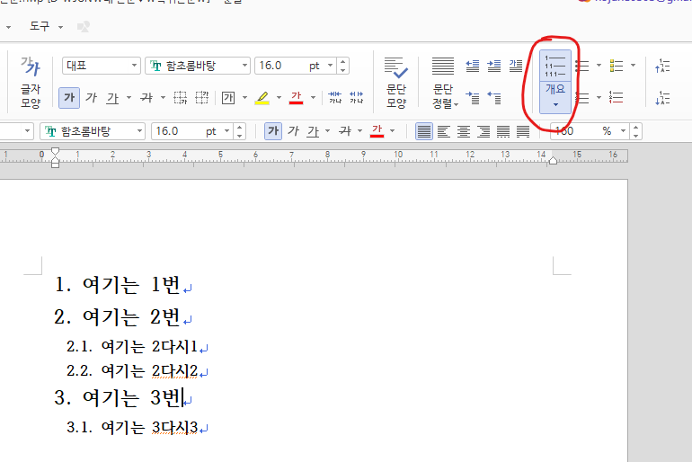
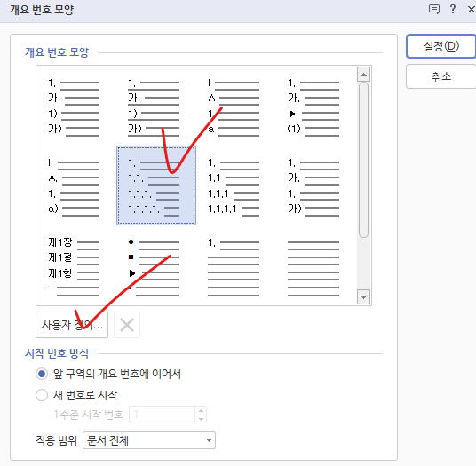

# 개요 번호, 문단 번호

굉장히 유사한 부분이 많고 아직 구체적으로 파악은 못했으나, 아래와 같은 상황에서는 이 방법을 적용하자.

  

위와 같이 각 개요별로 child 개요를 먹일 때, 이 child 개요가 다른 높은 개요들에 영향이 가지 않게 하는 방법이다.

순서

1. 위 빨간 표시 한 부분을 활성화 시켜라. (단축키 `ctrl + insert`)
2. **한 수준 아래** 기능을 통해 다른 개요에 영향이 가지 않는 child 개요를 사용한다.
    - 단순히 `개요`만 적용 시켜놓고 한 수준 아래 기능을 쓰면 그 child 개요가 다른 개요들 순서에 영향을 미친다.

child 개요들의 속성을 지정하고 싶다면 `ctrl + k + o`를 누른 후  

  

원하는 개요 번호 모양 클릭 후 사용자 정의를 통해 customizing 하자

p.s 문단 번호를 활성화 하는 방법은 `ctrl + shift + insert`, 문단 번호 설정 방법은 `ctrl + k + n`이다. 근데 아직 문단 번호를 언제 써야할지 모르겠다.. 내 생각엔 개요를 통해 전체 틀을 잡고, 만약 각 내용중에 특수한 목적으로 순서를 통해 문서 작성하는게 필요할 때 마다 **임시로 쓰기 위한 일종의 temp 역할인듯 하다.**
{:.info}

# 쪽 번호 만들기

쪽 -> 쪽 번호 매기기
    - 쪽이 보이도록 하거나 보이지 않도록 설정

# 차례 만들기

도구 -> 차례/색인 -> 차례 만들기