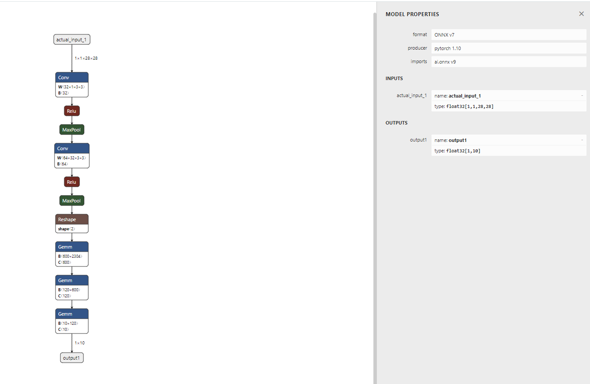

> 본 포스트는 Pytorch로 개발한 커스텀 모델을 Android에서 실행시키기 위해 Onnx를 활용하고 싶은 분들을 위한 포스트 입니다.

참고 블로그: [https://beeny-ds.tistory.com/22](https://beeny-ds.tistory.com/22)

# ONNX

ONNX(Open Neural Network Exchange)는 서로 다른 DNN 프레임워크로 만들어진 모델들이 존재할 때, 모델끼리 서로 호환되면서 사용할 수 있도록 만들어진 공유 플랫폼이다.  
따라서, Deploy 단계에서 다양한 디바이스(ex. 스마트폰)에서 사용할 때 활용하면 좋다.  
또한 TensorRT등의 가속 라이브러리와 연동도 가능하다고 하니 실시간(Real-Time) ai 서비스를 위해서라면 꼭 익혀두는것이 좋을것으로 보인다.

# 코드를 통한 실행 과정

[Juneer Deeplearning cookbook](https://github.com/Yanghojun/Juneer_deeplearning_cookbook/blob/master/utils/use_onnx.py)에서 전체 코드를 확인할 수 있다.

## onnx export

```python
def export_onnx(model:torch.nn, save_path:str):
    # 아래 예시는 배치사이즈 1, Fashion MNIST 데이터를 학습한 pytorch 모델에 대한 것임
    model.eval()
    dummy_input = torch.randn(1, 1, 28, 28)

    # onnx 모델의 가중치를 접근하기위해 name specifying이 가능한것으로 보임
    # input 부분에 대한 name specifying만 해도 충분할 것으로 보임
    input_names = ['actual_input_1'] + [f'learned_{i}' for i in range(20)]
    output_names = ['output1']

    torch.onnx.export(
        model, 
        dummy_input,
        os.path.join(save_path, 'ts_mn.onnx'),
        verbose=True,       # export 할 때 사람이 읽을 수 있도록 print문으로 콘솔창에 출력
        input_names=input_names, 
        output_names=output_names
        )
```

## onnx inference

세션을 만들고, run을 추가적으로 해줘야 하는 작업이 필요하다.

```python
def create_session(onnx_path:str):
    ort_sess = ort.InferenceSession(onnx_path)
    outputs = ort_sess.run(
        None,
        {'actual_input_1':np.random.randn(1,1,28,28).astype(np.float32)},  # 여기서는 numpy를 사용해야 한다고 함
                                                                           # fashion mnist의 데이터에 맞게, batch:1, channel: 1, height: 28, width: 28로 구성했다.
    )
    print(outputs)      # Fashion mnist 데이터셋의 10개 클래스에 대한 softmax 결과를 확인할 수 있다.
```

## onnx 시각화

[Netron 웹페이지](https://netron.app/)에 onnx 파일을 upload하면 모델의 전체적인 architecture를 확인할 수 있다.

<p align="center">  </p>
<div align="center" markdown="1">
우측의 MODEL PROPERTIES 창은 `ctrl + enter`로 확인할 수 있다.
</div>