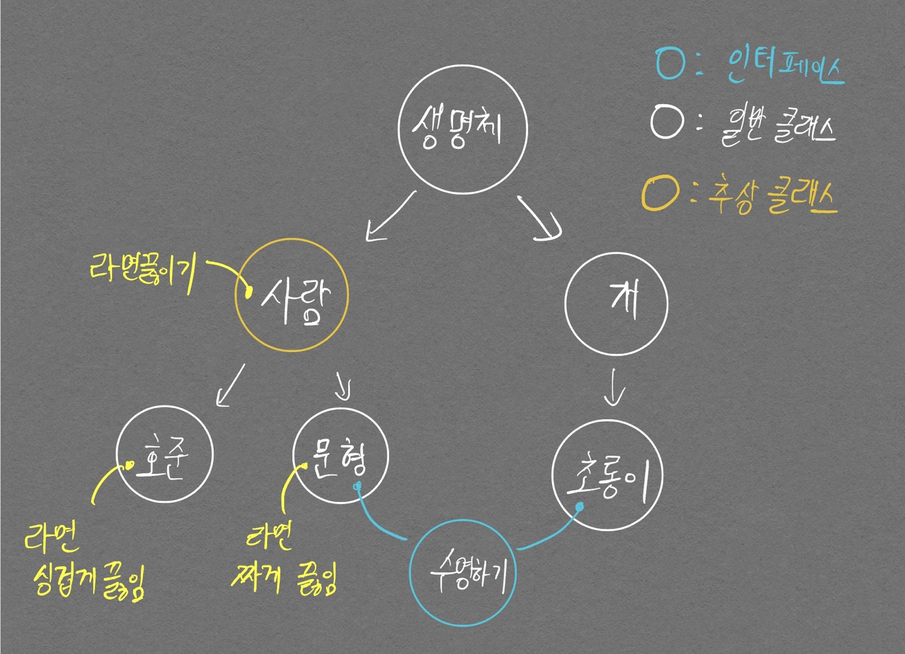

> 본 포스트는 직접 미션을 구현해가며 객체지향 프로그래밍의 개념을 익히고자 만들었습니다. 기반 언어는 `python` 입니다.

포스트를 시작하기 앞서 `python`에서 상속 기능을 어떻게 수행할 수 있는지 기초 개념을 잡고자 한다.

클래스 변수, 인스턴스 변수 개념부터 잡고 가는것이 좋다.

```python
class Account:
    num_accounts = 0
    
    def __init__(self, name):
        self.name = name
        Account.num_accounts += 1

    def __del__(self):
        Account.num_accounts -= 1
```

위 코드에서 `num_accounts`가 **클래스 변수**, `self.name`이 **인스턴스 변수** 이다.

클래스 변수는 하나의 클래스가 모두 공유하는 변수이며, 인스턴스 변수는 각 인스턴스 별로 따로 할당된 변수이다.

```python
class Account:
    num_accounts = 0
    
    def __init__(self, name):
        self.name = name
        Account.num_accounts += 1

    def __del__(self):
        Account.num_accounts -= 1

    def show(self):
        print(self.name)

class PersonA(Account):
    
    def __init__():
        return

if __name__ == '__main__':
    A = PersonA()
    A.show()        # 에러가 난다 그 이유는?
```

`A.show()`가 에러가 나는 이유가 무엇일까? Account가 부모 클래스이니 자동으로 Account.\_\_init\_\_()이 호출되었을 것 같은 기분이 들지만..! `python`에서는 Account.\_\_init\_\_()을 호출하지 않는다. 그래서 self.name을 선언한 적이 없는 것이다.

Account.\_\_init\_\_()을 호출하기 위해 필요한것이 `super()` 메소드이다. 예외적으로 자식 클래스에 \__init_\_이 없다면 부모 클래스의 \__init_\_이 호출된다.

좀더 확실하게 보려면 `dir()`을 호출해서 특정 `PersonA()`의 인스턴스가 어떤 속성과 메소드를 가졌는지 확인해보면 된다.

```
['__class__', '__del__', '__delattr__', '__dict__', '__dir__', '__doc__', '__eq__', '__format__', '__ge__', '__getattribute__', '__gt__', '__hash__', '__init__', '__init_subclass__', '__le__', '__lt__', '__module__', '__ne__', '__new__', '__reduce__', '__reduce_ex__', '__repr__', '__setattr__', '__sizeof__', '__str__', '__subclasshook__', '__weakref__', 'num_accounts', 'show']
```

위 결과에서 봤을 때 부모 클래스의 show 메소드까지는 확인할 수 있지만 **name 속성은 없다!**

# Mission 1

<div align="center" markdown="1">
라면 레시피가 존재한다. 그래서 호준, 문형이는 라면을 만들 수 있다. 호준, 문형은 레시피 순서(물 넣기, 물 끓이기, 스프 넣기)를 지키지만 물을 얼마나 넣을지, 어느정도 시간동안 끓일지, 스프를 얼마나 넣을지는 각자의 입맛에 맞게 요리한다. 이러한 역할 수행이 가능하도록 라면 레시피 Class, 호준 Class, 문형 Class를 구현해보자.
</div>

## 필요 개념 정리

- 추상 클래스
- 인터페이스
- 상속

### 추상 클래스, 인터페이스, 상속

추상 클래스를 이해하기 위해선, 개념을 잘 잡고 들어가야 한다. 모든 클래스는 **일반 클래스**, **추상 클래스**로 나뉜다.

파이썬을 활용한 추상 클래스 활용법은 [여기](/ObjectOrientedPython)를 참고하자.

추상 클래스를 도대체 왜 쓸까? 다음의 이유 때문이다.
- **상속**받는 클래스에서 메서드 구현을 강제하기 위함.

나를 포함한 많은 사람들이 헷갈리는 것이 추상 클래스와 인터페이스의 차이이다. 이 차이가 대체 뭘까? 다음 그림으로 박살내보자.

<p align="center">  </p>


`라면 끓이기`: 사람 클래스에 라면 끓이기 메서드를 abstract 형태로 구현한다. 그러한 이유는 Mission 1 에서 설명했듯, 사람마다 라면 끓이는 방식이 다르기 때문이다. 호준 클래스에서 `라면 끓이기` 메서드의 구체화로 라면 싱겁게 끓임, 문형 클래스에서 라면 짜게 끓임으로 구현이 완성된 걸 볼 수 있다.

`수영 하기`{:.info}: 중요한건 이 부분이다. 수영하기 라는 인터페이스가 문형 클래스, 초롱이 클래스에서 활용된다. 주목할 것은 **호준 클래스는 수영을 못한다는 것**이다. 호준, 문형이 같은 사람 클래스이지만, 수영을 하고, 못하고의 차이가 발생한다는 것이다. 또한, 문형, 초롱이는 서로 다른 상속 관계를 가지고 있지만, **수영이라는 기능 자체는 동일하게 수행이 가능하다**(단, 헷갈리지 말 것은, 문형, 초롱이의 수영 방식이 달라서(문형이는 자유형, 초롱이는 개헤엄 등) 서로 다른 형태로 구현되어야 할 것이다.)

정리하자면 추상 클래스는 상속 관계를 준수하면서 사용방법을 통일[^1]하고, 동작 구현을 상속 받는 클래스에게 넘긴다. 이는 기존 클래스에서 새로운 기능을 확장하는 것이다.

[^1]: 사용방법을 통일한다는 말은 내가 정한 메서드를 호출하는 것을 말한다. 예를 들어 호준 클래스에서나, 문형 클래스에서나 `라면 끓이기()` 형태로 라면 끓이기 기능을 호출할 수 있다.

인터페이스는 상속 관계를 무시하면서 사용방법을 통일하고, 동작 구현을 인터페이스를 활용하는 클래스에게 넘긴다. 이는 클래스 관계는 무시한 채 기능을 장착하는 것이다.

이 개념만 가지고는 감이 잘 안올것이다. 그래서 Mission 1을 통해 익히고자 한다.

## 구현 코드

라면 끓이기 기능에 대해서 구현해봤다. 포스터 글이 이해가 잘 됐다면, 수영하기를 인터페이스 형태로 구현하는것도 가능할 것이다.

```python
# 추상클래스 구현
from abc import *

class NoddleReceipe(metaclass=ABCMeta):
    def make_noddle(self):
        self.set_water()
        self.boil_water()
        self.input_soup()

    @abstractmethod
    def set_water():
        raise NotImplementedError

    @abstractmethod
    def boil_water():
        raise NotImplementedError
    
    @abstractmethod
    def input_soup():
        raise NotImplementedError

class Hojun(NoddleReceipe):
    def __init__(self, weight):
        self.weight = weight

    def set_water(self):
        print("물 500ml 넣기!")
    
    def boil_water(self):
        print("5분동안 끓이기!")

    def input_soup(self):
        print("수프는 1/3 만 넣기!")

class Munhyung(NoddleReceipe):
    def __init__(self, weight):
        self.weight = weight

    def set_water(self):
        print("물 2000ml 넣기!")
    
    def boil_water(self):
        print("8분동안 끓이기!")
    
    def input_soup(self):
        print("수프 가득 넣기!")

hojun = Hojun(65)
munhyung = Munhyung(90)
print("### 호준 방식대로 라면 끓이기")
hojun.make_noddle()
print('-' * 50)
print("### 문형 방식대로 라면 끓이기")
munhyung.make_noddle()
```

    ### 호준 방식대로 라면 끓이기
    물 500ml 넣기!
    5분동안 끓이기!
    수프는 1/3 만 넣기!
    --------------------------------------------------
    ### 문형 방식대로 라면 끓이기
    물 2000ml 넣기!
    8분동안 끓이기!
    수프 가득 넣기!