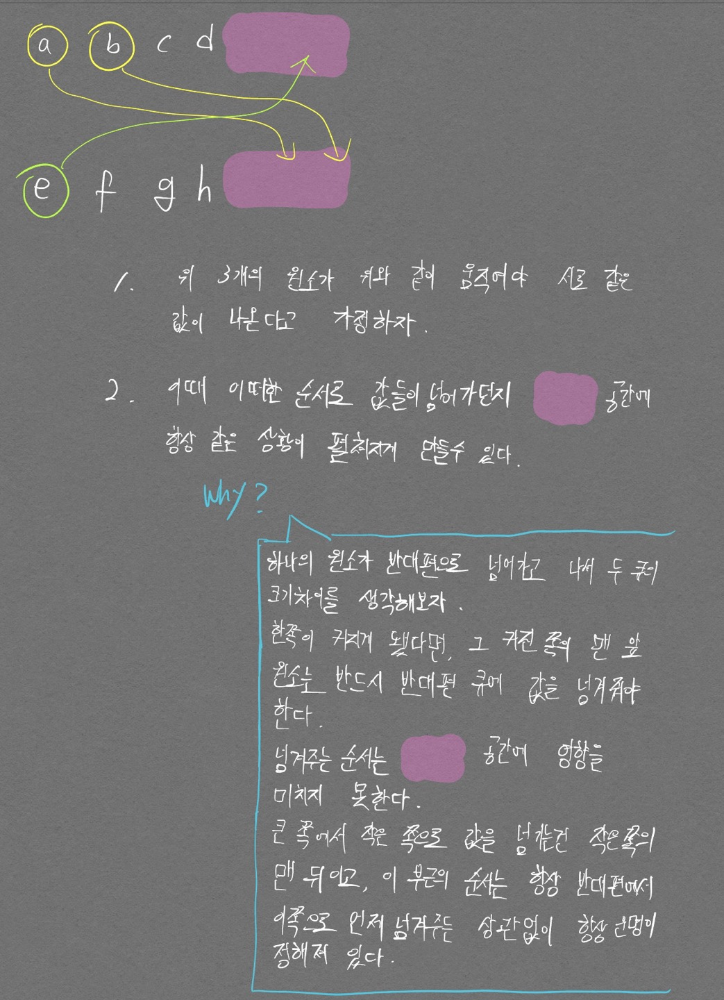

# 두 큐합 같게 만들기
출처: 카카오  
난이도: lv2

- 그리디 문제였지만 유형 분류를 제대로 못하고 풀지 못하였다.
- 풀이를 봐도 다음의 내용을 이해는게 정말 오래걸렸다.
  - queue1, queue2가 있다고 할 때 크기가 큰 queue에서 작은 queue로 무조건 하나의 원소를 넘겨줘야 한다. 크기가 같아지려면 반드시 큰 queue에서 작은 queue로 넘겨주는 작업은 필수이기 때문이다.
    - 위 말 까지는 어느정도 이해가 갔지만, 항상 큰 쪽에서 작은쪽으로 넘기는게 아니라, 특수한 경우에는 작은 쪽에서 큰 쪽으로 넘기고, 다시 큰 쪽에서 작은 쪽으로 넘기면 더 최소의 경우의 수가 나올 수 있지 않나 싶었다. 아래 그림을 그려서 간신히(?) 이해했다.

<p align="center">  </p>

<div align="center" markdown="1">
글 길이의 압박이 좀 있지만 천천히 생각하면서 읽어보자!
</div>

```python
from collections import deque

def solution(queue1, queue2):
    q1 = deque()
    q2 = deque()
    
    # append가 아니라 extend로 해야하나..
    # 그냥 한번에 초기화를 해도 되는구나
    q1.extend(queue1)
    q2.extend(queue2)
    
    # if (sum(q1) + sum(q2)) % 2 != 0:
    #     answer = -1
    #     return answer
    
    cnt = 0
    
    num = len(queue1)
    fail = True
    
    val1 = sum(q1)
    val2 = sum(q2)
    
    for i in range(4 * num):
        if val1 == val2:
            fail = False
            break
        elif val1 > val2:
            tp_val = q1.popleft()
            q2.append(tp_val)
            val1 -= tp_val
            val2 += tp_val
        else:
            tp_val = q2.popleft()
            q1.append(tp_val)
            val2 -= tp_val
            val1 += tp_val
        # print(q1, q2)
        cnt += 1
        
    if fail:
        answer = -1
    else:
        answer = cnt
        
    return answer
```

- 위 코드에서 `deque`를 초기화 할 때 한번에 초기화 하는 방법이 있었다. 난 그걸 모르고 `extend`까지 써가면서 내장메서드 `sum()`을 적용하려고 안간힘을 썼다.
- 또한 `sum()` 내장함수의 수행시간이 $$ O(N) $$인 점을 반드시 감안해야 한다. 그렇지 않고 `for`문에서 `sum()`을 사용하는 순간 runtime error가 발생하게 된다.

```python
q1 = deque(queue1)
q2 = deque(queue2)
```

# 2212번 (센서)

문제부터 잘 이해가 안됐다. 집중국의 수신 가능 영역이라고 말을 하길래 집중국 기준으로 -2 에 센서 하나 있고, +3 에 센서 하나 있을 때의 수신 가능 영역이 3인지, 6인지, 5인지 구분이 안갔다. 지금도 문제를 읽으면 뭐로 해야할지 잘 모르겠지만 결론은 5다.. 문제 내용 중 **수신 가능 영역은 고속도로 상에서 연결된 구간으로 나타나게 된다.** 라는 말이 있는데 이 말이 핵심인 듯 하다.

아이디어는 다음과 같다.

<p align="center">  </p>

위 아이디어를 어떻게 이용해야 수신 가능 영역의 최솟값을 구할 수 있을까? 아래 그림을 보면 답이 나온다.

<p align="center">  </p>

핵심은 `집중국 갯수 - 1` 만큼 거리 차이를 없앨 수 있다는 것이다. 그러니, 가장 거리 차이가 큰 것 부터 `집중국 갯수 - 1`만큼 순차적으로 제거를 하고, 남은 거리값의 합을 구한다면 그것이 정답이 된다.

```python
n = int(input())
k = int(input())

coor = list(map(int, input().split()))
coor.sort()

dist = []
for i in range(1, n):
    dist.append(coor[i]-coor[i-1])
dist.sort(reverse=True)

dist = dist[k-1:]
print(sum(dist))
```