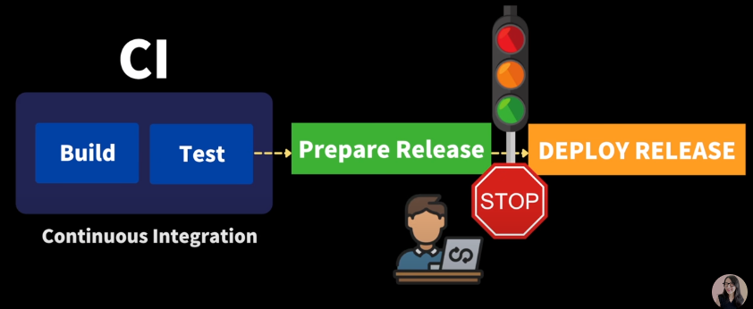

> 본 포스트는 [모두의 MLOPS](https://mlops-for-all.github.io/), 유튜버 [드림코딩](https://www.youtube.com/watch?v=0Emq5FypiMM), 패스트캠퍼스 [머신러닝 서비스 구축을 위한 실전 MLOps](https://fastcampus.co.kr/data_online_mlops)를 참고했습니다.

# MLOPS가 나온 배경

10개 기업에서 AI 프로젝트를 한다고 하면 9개는 컨셉검증(POC)만 하다 끝나는 문제 다수 발생. 스타트업 수준이 아니라 대기업에서 AI 프로젝트를 진행하기 시작하면서 지속적 개발, 운영의 중요성이 확대됨.

단어의 어원은 DevOps(Development + Operations)로 부터 나온것으로 말 그대로 **개발, 운영**에 초점을 맞춰 소프트웨어를 빠르게 개발 및 배포하는 것을 목적으로 함.

DevOps의 목표: 개발팀에서 개발한 기능이 정상적으로 배포될 수 있는지 확인  
MLOps의 목표: 머신러닝 팀에서 개발한 모델이 정상적으로 배포될 수 있는지 확인

# MLOPS 역할 별 상용 프로그램
- Data Pipeline: Sqoop, Flume, Kafka, Flink, Spark Streaming, Airflow
- Data Store: MySQL, Hadoop, Amazon S3, MinlO
- Data Management: TFDV, DVC, Feast, Amundsen
- Model Development: JupyterHub, Docker, Kubeflow, Optuna, Ray, katlib
- Model Version Management: Git, MLflow, Github Action, Jenkins
- Model Training Schedule Management: Grafana, Kubernetes
- Model Packaging: Docker, Flask, FastAPI, Kubeflow, TFServing
- Serving Monitoring: Prometheus, Grafana, Thanos
- Pipeline Managing: Kubeflow, argo workflows, Airflow
    
# 왜 Docker, Kubernetes를 쓸까?
한명의 사용자가 여러대의 서버 컴퓨터를 사용해도 마치 하나의 컴퓨터를 사용하는 것처럼 느끼게 해줌. 어떻게? 하드웨어의 소프트웨어화를 통해서!

이를 좀더 그럴싸하게 말해보면 아래와 같다.

MLOps을 위해 필요한 3가지 요소

1. Reproducibility(재생력) -> 실행 환경의 일관성 & 독립성
2. Job Scheduling   ->  스케줄 관리, 병렬 작업 관리, 유휴 작업 관리
3. Auto-healing & Auto-scaling  ->  장애 대응, 트래픽 대응

가 있으며 도커의 Containerization(컨테이너화), 쿠버네티스의 Contaier Orchestration(컨테이너 통합)이 위 요소 구현에 효율적이다.

조금 더 실무 사례로 예를 들면 다음과 같다.

---

AI 프로젝트의 규모가 클수록 수많은 머신러닝 모델이 학습을 요청하거나, 서로 다른 작업 공간에서 동일 실행 환경을 보장하거나, 배포된 서비스 장애시 빠르게 대응해야 하는 등의 이슈가 발생할 수 있다.

이러한 문제 해결을 위해 컨테이너, 컨테이너 오케스트레이션 시스템[^1] 필요성 등장.

컨테이너, 컨테이너 오케스트레이션 시스템을 적용하면 머신러닝 모델 개발 및 배포과정에서 다수의 개발자가 소수 클러스터[^2]를 공유하며 _'1번 클러스터 사용중이신가요?'_, _'GPU 사용 중이던 제 프로세스 누가 죽였나요?'_ 와 같은 상황 방지 가능.

혹은, 딥러닝 학습 코드가 패키징된 컨테이너는 성능 좋은 GPU가 있는 클러스터에서 수행하고, 많은 메모리를 필요로 하는 데이터 전처리 코드가 패키징된 컨테이너는 메모리 여유가 많은 클러스터에서 수행하는 등의 작업을 본 시스템을 통해 수월하게 할 수 있다.

---

아래 그림은 Kubernetes의 구조이다.

<p align="center">  </p>

<div align="center" markdown="1">
출처: [https://kubernetes.io/docs/concepts/overview/components/#control-plane-components](https://kubernetes.io/docs/concepts/overview/components/#control-plane-components)
</div>

위 구조를 통해 사용자가 마치 하나의 컴퓨터만 사용하는것처럼 느끼게 한다는데 실습을 진행해야 체감이 될 듯 하다.  그림의 몇가지 중요 요소들을 정리해보자.  

## kubernetes 핵심 요소

MasterNode와 WorkerNode로 나뉜다.

- MasterNode: 서버 관리 목적 -> WorkerNode들을 적절하게 스케줄링 해줌.
  - API server: 사용자가 보낸 요청(Desired state)를 받음
  - etcd: 사용자가 보낸 요청(.Desired state)를 `key, value` 형식으로 저장한 데이터베이스
  - Cloud controller manager
  - Controller manager
- WorkerNode: 컨테이너 구동 목적
  - `Kubelet`{:.error}: API server로 부터 명령을 받아서 수행하고, 현재 WorkerNode 상태를 다시 전송하는 역할
  - Node: Kubernetes에서 컨테이너 실행을 위한 가장 작은 단위. 한개의 Cluster는 최소 한개의 Node를 가짐.

- Pod: Kubernetes에서 생성, 관리, 배포 가능한 **가장 작은 컴퓨팅 단위**. 
  - 하나의 Pod안에 1개 ~ 여러개의 컨테이너가 들어갈 수 있음.
  - 언제든지 삭제될 수 있는 자원.
  - yaml 파일로 작성

    ```yaml
    apiVersion: v1 # kubernetes resource 의 API Version
    kind: Pod # kubernetes resource name
    metadata: # 메타데이터 : name, namespace, labels, annotations 등을 포함
    name: counter
    spec: # 메인 파트 : resource 의 desired state 를 명시
    containers:
    - name: count # container 의 이름
    image: busybox # container 의 image
    args: [/bin/sh, -c, 'i=0; while true; do echo "$i: $(date)"; i=$((i+1)); sleep 1; done'] # 해당 image 의 entrypoint 의 args 로 입력하고 싶은 부분
    ```

- Deployment: Pod, Replicaset[^3]에 대한 관리를 제공하는 **단위**
  - 관리라는 것은 Self-healing[^4], Scaling, Rollout[^5]과 같은 기능 포함
[^1]: 쿠버네티스 클러스터는 애플리케이션 컨테이너를 실행하기 위한 일련의 노드 머신
[^2]: 수많은 컨테이너가 서로 조화롭게 구동될 수 있도록 지휘하는 시스템
[^3]: 지정된 수의 Pod가 잘 돌아가게 해줌
[^4]: 예를 들어 작업 진행중 특정 pod가 모종의 이유로 정지됐을 경우 다시 동일 역할을 하는 pod를 재생성시킴.
[^5]: 서비스 중지하지 않고 업데이트 진행하는 것

- PV(Persistent Volume), PVC(Persistent Volume Claim): stageless 한 Pod가 영구적으로 데이터를 보존하고 싶을 때 사용하는 리소스.  `docker run`의 `-v` 옵션과 유사함.
  - 모종의 이유로 어떤 Pod가 종료가 되었어도, PVC를 mount한 pod 였고, 지정한 경로에 데이터를 지정해 둔 상태라면, **데이터가 보존됀다.**

# MLops 모듈 살펴보기

## DVC

Data Version Control -> 데이터 버전 관리 프로그램.

Git은 코드를 관리하기는 좋지만 대용량의 데이터를 업로드는 용량 제한으로 인해 어려움.

코드의 version에 맞춰서 데이터의 version도 알맞게 제공해주는것이 주 목적.

따라서 본 DVC 프로그램은 `google drive, AWS 등과 같은 remote storage`{:.warning} + `Git`{:.info}으로 코드, 데이터를 유저들에게 깔끔하게 제공할 수 있다.

## MLflow

팀 내에서 협업해서 모델 성능을 발전시키려면 다음의 요소들이 공유되야함.

- Model 소스코드
- Evaluation Metric 결과
- Hyper parameters
- model.pkl
- Data
- 전처리 코드
- etc..

팀원들의 작업환경이 완전히 통일되어있지 않으면 환경의 Dependency, 사람의 실수 등으로 인해 **Model Reproducing이 떨어짐**.

이를 방지하기 위해 Model Management의 필요성이 생겼고 다음과 같은 Tool들이 생김.

- MLflow, Tensorboard, Neptune, Weights & Biases, Comet.ml

지금은 MLflow에 대해서 알아볼 것이며 다음과 같은 4가지의 구성요소로 이루어짐

- `tracking`{:.error}: 모델의 parameters, metric, data 자체, 코드 변경 등의 모델 관련 meta 정보의 저장을 API 형태로 제공하는 것.
- projects: 모델 학습 코드가 reproducible 하도록 python version, conda version, pytorch verion등의 dependency 정보를 함께 넣어서 코드 패키징 하는 것.
- models: 모델이 어떤 프레임워크를 사용하던 상관없이 동일 형태로 배포 가능하도록 하는 것.
- model registry: 실험했던 모델을 저장, 관리하는 **저장소**

<p align="center">  </p>
<div align="center" markdown="1">
mlflow tracking server를 띄우고 실험 정보 업로드됀 모습
</div>

# 필요한 사전 핵심 지식

## CI/CD (Continuous Integration/Continuous Delivery)

| CI/CD 개념은 유튜버 님의 영상을 참고했습니다.

요즘같이 빠른 시장 변화와 고객 요구를 반영해서 빠르게 제품을 출시 or 업데이트 하여 배포하기 위해 탄생한 개념

> 어플리케이션 개발부터 배포까지의 모든 단계를 **자동화**해서 고객에게 빈번히 배포될 수 있도록 함

### CI 자세히 알아보기

Github 협업과정을 생각하면 편함.  

주기적으로 버그, 버전 업데이트등을 main repository에 주기적이고 빈번하게 merge 하는 것  

주기적이고 빈번하게 하는 것이 중요. 이를 통해 merge conflict가 복잡해지거나, 치명적인 버그 발생하는 것을 사전 차단할 수 있음.

Main Repository 코드가 build, test까지 모두 완료하는지 확인까지 하는것이 CI 과정

### CD 자세히 알아보기

~~ 여기부터 작성
  