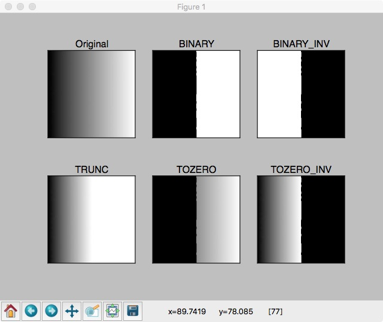
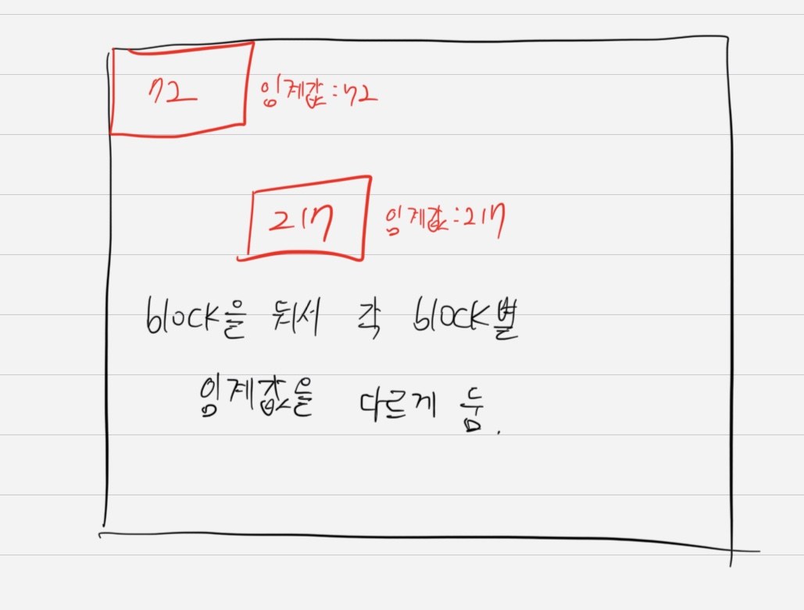
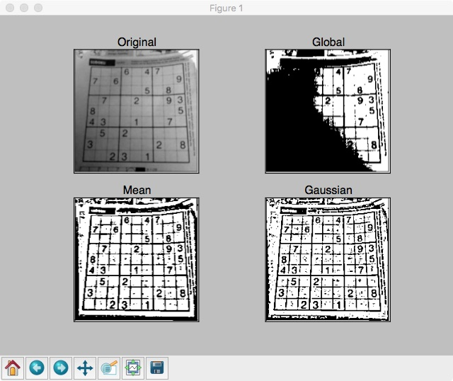
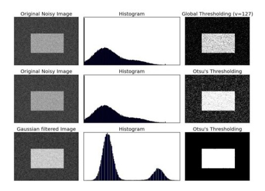

# PIL
- RGB로 이미지를 읽어와서 torchvision 바로 사용 가능.
  - torchvision이 어디서 쓰이길래? -> Pytorch 프레임워크에서 쓰기 위한 데이터 변환이 바로 됌.

    <p align="center" markdown="1">
    PIL 객체를 통해 Numpy로 변환했을 경우 "H x W x C" 형태  

    "H x W x C" -> "C x H x W" 형태로 변환  

    이미지 픽셀 값 범위를 0 ~ 255 -> 0 ~ 1로 변환해주기 위해 아래 메소드 사용
    </p>

    ```python
    import torchvision
    torchvision.transforms.ToTensor()
    ```

- numpy array와의 암묵적 casting이 되지 않아서 numpy array를 Image array로 변경해줘야 함

## Numpy to Tensor

```python
torch.from_numpy(ndarray:numpy.ndarray)
```

## Tensor to Numpy

```python
tensor_data.numpy()
```

## Tensor to Image(png, jpg)

```python
torchvision.utils.save_image(tensor, fp)
```

## Tensor to PILImage

```python
import torchvision.transforms as T

trans = T.TOPILImage()
image_data = trans(tensor_data)
```


# OpenCV
- OpenCV는 BGR로 읽어옴
- 이미지 처리에 필요한 거의 모든 함수 지원
- numpy array 인덱싱을 이용해 직관적인 이미지 전처리 가능
- Video capture 같은 기능의 지원이 잘 되어 있음

## 마스킹(Masking)

마스킹 작업을 하기 전 각 픽셀들의 데이터 타입을 uint8로 지정해주는 것이 좋다.
{:.info}

```python
import numpy as np

# Numpy의 경우
arr = arr.astype(np.uint8)
```
### 이미지 임계처리

#### Simple thresholding

특정 기준치 넘기면 지정해둔 maxvalue로 값 치환

```python
import cv2
import numpy as np
from matplotlib import pyplot as plt

img = cv2.imread('gradient.jpg',0)

ret, thresh1 = cv2.threshold(img,127,255, cv2.THRESH_BINARY)
ret, thresh2 = cv2.threshold(img,127,255, cv2.THRESH_BINARY_INV)
ret, thresh3 = cv2.threshold(img,127,255, cv2.THRESH_TRUNC)
ret, thresh4 = cv2.threshold(img,127,255, cv2.THRESH_TOZERO)
ret, thresh5 = cv2.threshold(img,127,255, cv2.THRESH_TOZERO_INV)

titles =['Original','BINARY','BINARY_INV','TRUNC','TOZERO','TOZERO_INV']
images = [img,thresh1,thresh2,thresh3,thresh4,thresh5]

for i in xrange(6):
    plt.subplot(2,3,i+1),plt.imshow(images[i],'gray')
    plt.title(titles[i])
    plt.xticks([]),plt.yticks([])

plt.show()
```

<p align="center">  </p>
위 그림에서 볼 수 있듯 thresholding type 파라미터를 활용하여 이진화가 아닌 gradual한 이미지 출력도 가능하다.

#### Adaptive thresholding

이미지별로 빛의 세기, 분포가 다르기에 threshold 입력된 이미지마다 적절히 주기 위함

<p align="center">  </p>

```python
import cv2
import numpy as np 
from matplotlib import pyplot as plt 

img = cv2.imread('images/dave.png',0)
# img = cv2.medianBlur(img,5)

ret, th1 = cv2.threshold(img,127,255,cv2.THRESH_BINARY)


th2 = cv2.adaptiveThreshold(img,255,cv2.ADAPTIVE_THRESH_MEAN_C,\
cv2.THRESH_BINARY,15,2)
th3 = cv2.adaptiveThreshold(img,255,cv2.ADAPTIVE_THRESH_GAUSSIAN_C,\
cv2.THRESH_BINARY,15,2)

titles = ['Original','Global','Mean','Gaussian']

images = [img,th1,th2,th3]

for i in xrange(4):
    plt.subplot(2,2,i+1),plt.imshow(images[i],'gray')
    plt.title(titles[i])
    plt.xticks([]),plt.yticks([])

plt.show()
```

<p align="center">  </p>


#### Otsu binarization

히스토그램에서 2개의 peak가 있는 이미지가 있을 경우 이진화를 위한 threshold 값을 상당히 정확하게 구해줌

```python
import cv2
import numpy as np 
from matplotlib import pyplot as plt 

img = cv2.imread('images/noise.png',0)

# global thresholding
ret1, th1 = cv2.threshold(img, 127, 255, cv2.THRESH_BINARY)

ret2, th2 = cv2.threshold(img, 0, 255, cv2.THRESH_BINARY+cv2.THRESH_OTSU)

blur = cv2.GaussianBlur(img,(5,5),0)

ret3, th3 = cv2.threshold(img, 0, 255, cv2.THRESH_BINARY+cv2.THRESH_OTSU)

# plot all the images and their histograms
images = [img, 0, th1, img, 0, th2, blur, 0, th3]

titles = ['Original Noisy Image','Histogram','Global Thresholding (v=127)', 'Original Noisy Image','Histogram',"Otsu's Thresholding", 'Gaussian filtered Image','Histogram',"Otsu's Thresholding"]

for i in xrange(3):
    plt.subplot(3,3,i*3+1),plt.imshow(images[i*3],'gray')
    plt.title(titles[i*3]), plt.xticks([]), plt.yticks([])
    plt.subplot(3,3,i*3+2),plt.hist(images[i*3].ravel(),256)
    plt.title(titles[i*3+1]), plt.xticks([]), plt.yticks([])
    plt.subplot(3,3,i*3+3),plt.imshow(images[i*3+2],'gray')
    plt.title(titles[i*3+2]), plt.xticks([]), plt.yticks([])

plt.show()
```

<p align="center">  </p>

위 그림의 마지막 row는 noise를 gausian blur를 활용해 제거한 뒤 otsu 이진화를 진행한것이다.

# 바운딩박스 좌표 읽어서 이미지 자르는 예시


```python
import json

def get_coor_from_json(path):
    with open(path) as f:
        raw_data = json.load(f)
        print(raw_data)

    return raw_data['shapes'][0]['points']
        

box_coor = get_coor_from_json('./cat1.json')    #[[x1, y1], [x2, y2]]

img = Image.open('./data/cat1.jpg')

x1,y1,x2,y2 = box_coor[0][0], box_coor[0][1], box_coor[1][0], box_coor[1][1]
print(x1, y1, x2, y2)
img = img.crop([x1, y1, x2, y2])
img.show()
```

    {'version': '5.0.1', 'flags': {}, 'shapes': [{'label': 'normal', 'points': [[171.99999999999997, 46.666666666666664], [333.8181818181818, 172.72727272727272]], 'group_id': None, 'shape_type': 'rectangle', 'flags': {}}], 'imagePath': 'data\\cat1.jpg', 'imageData': None, 'imageHeight': 408, 'imageWidth': 612}
    171.99999999999997 46.666666666666664 333.8181818181818 172.72727272727272
    


```python
img = Image.open('./data/cat1.jpg')

width, height = img.size

img = img.crop([0,0,width/2,height/2])
img.show()
```