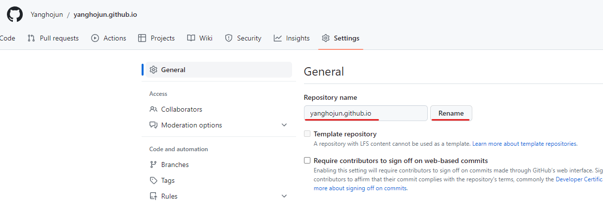

> --- layout: home # Index page --- 에러 해결
> Windows10에서 동작하는 것 확인. Linux, MacOS는 더 쉽게 될 것으로 예상
> Windows10에서 bash tools/init 명령어 사용 못하지만 별 문제 없었음

가장 크게 시간을 썼던 부분은 `https://yanghojun.github.io`에 접속시 --- layout: home # Index page --- 만 뜨고 블로그 테마가 로딩되지 않는 문제가 있었어요.

아래 과정을 천천히 따라하시면 다른 분들은 저처럼 하루 절반을 날리는 일은 없을것으로 생각됩니다.. ㅎㅎ

## 1단계. GitHub Fork

Fork를 통해 `깃헙아이디.github.io`로 Repository 이름을 수정해주세요.



### Node.js 설치

Node.js를 설치해주세요 [설치 사이트](https://nodejs.org/ko/download)

```bash
# Node.js 설치 여부 확인
npm --version
```

```bash
# 터미널에서 로컬에 clone한 경로로 이동해서
npm install
npm run build
```

`bash tools/init` 명령어는 Windows10에서 실행되지 않지만, 전혀 문제 없어요!

## 2단계. 로컬호스트에서 확인하기

```bash
# Ruby를 사전에 설치해야해요

# 터미널에서 로컬에 clone한 경로로 이동해서
bundle

bundle exec jekyll s
```

위까지 잘됐으면 이제 배포 단계를 진행해야해요. 그래야 구글검색창에 `깃헙아이디.github.io`를 입력했을때 여러분의 블로그가 로딩돼요.

## 3단계. Github에서 배포 작업하기


<div align="center" markdown="1">
**Pages** 클릭
</div>


<div align="center" markdown="1">
**GitHub Actions** 클릭
</div>

가장 중요한것은 **jekyll.yml 파일**을 Github을 통해서 Local에 받아오는 과정이에요! 다음 영상을 꼭 참고해주세요.

[영상](https://www.youtube.com/shorts/Kq28yBigDYw)

위 영상에서는 pages.yml이 추가되지만 우리는 jekyll.yml이 추가될거에요.

이 상태에서 포스트를 작성하고 `git push origin master`를 통해 commit 한 내용들을 푸쉬하면 여러분이 작성한 글이 약 1분 후 `깃헙아이디.github.io` 주소를 통해 조회가 될거에요!!