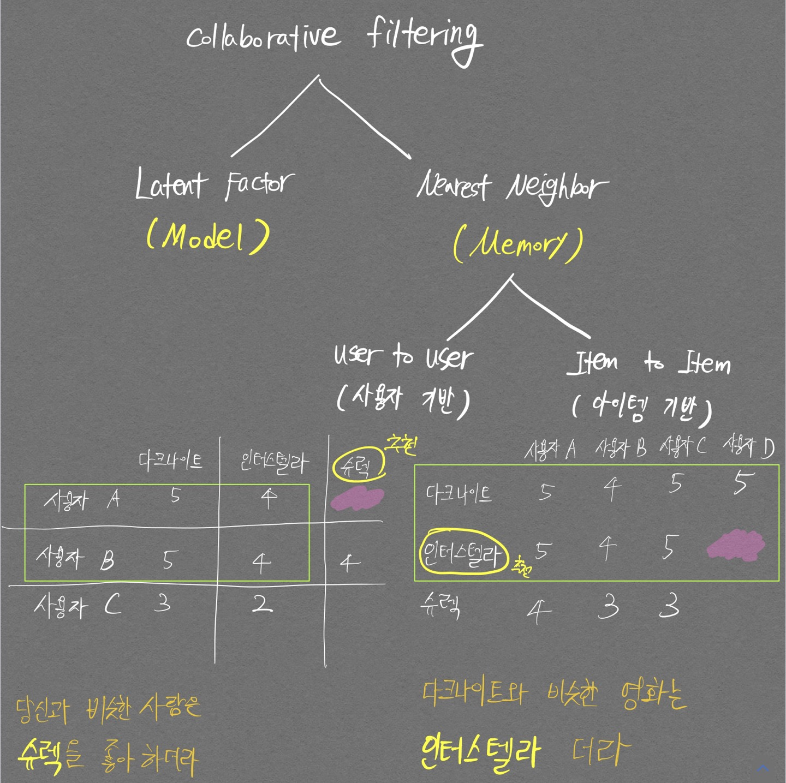

# 구조도

  

 추천시스템 수업 강의자료 

  

 파이썬 머신러닝 완벽가이드 구조도.  
아래 행렬표의 왼쪽 그림이 사용자 기반, 오른쪽 그림이 아이템 기반

# Collaborative filtering

가장 많이 사용되는 추천시스템 기법으로, 사용자가 아이템을 매긴 평점 정보나 상품 구매 이력과 같은 **사용자 행동 양식(User Behavior)만을** 기반으로 추천하는 것이다.  

Collaborative filtering은 다음의 두가지로 나뉘게 되며 각 항목별로 설명하고자 한다.
1. Nearest neighborhood
2. Latent factor

## Nearest neighborhood

## Latent Factor

행렬 분해(Matrix Factorization)을 활용해 Collaborative filtering을 구현하는 것을 의미한다.  
`user-item score matrix` 가 있을 때 행렬 분해를 적용하면 비어있는 값들을 채운 `predicted score matrix` 를 만들 수 있게 된다.  
주목할 만한 점은 이때의 `user-item score matrix`는 대부분의 값이 비워져있는 **sparse matrix** 이다.  
행렬 분해를 적용하기 위해 SVD(Singular Vector Decomposition) 방법을 자주 사용하지만 sparse matrix에 대해서 SVD를 바로 적용할 수 없어서 확률적 경사 하강법(Stochastic Gradient Descent)이나 ALS(Alternating Least Squares) 방식을 이용해 SVD를 수행한다.

## Memory based 방식
Similarity를 이용함.  

## Model based 방식
SVD, KNN과 같이 이미 구현되어있는 Model 이용함.
